# A Brief Analysis on K-12 Education

K-12, the catchy shorthand for the educational journey from Kindergarten to Grade 12, is more than just a sequence of grades; it's a stepping stone that paves the way to a brighter future. Join me on an exciting journey as we dive into the intriguing world of K-12 education in the vibrant regions of British Columbia (BC) and the bustling metropolis of Metro Vancouver.

## K-12 Education in BC

In the picturesque province of British Columbia, the adventure of learning is compulsory for all children aged 6 to 16. Here, the educational landscape comprises two main chapters: elementary (also known as primary) and secondary (also known as high school) education. These chapters unfold from Kindergarten to Grade 12, creating a captivating narrative of growth and development.

BC's young learners take their first steps into full-day Kindergarten at the tender age of five, embarking on an educational odyssey that propels them through elementary school, with graduation typically occurring at the age of 13. The journey continues into secondary school, commencing at 14 and culminating with graduation at 18, crowned with a coveted graduation certificate. Upon reaching this milestone, students can choose to venture into the realms of higher education, vocational training, or even dive headfirst into the workforce.

### School-Aged Population

Delving into the data from Statistics Canada, we uncover a fascinating narrative of change. Between 2000 and 2020, the school-aged population (ages 5-17) experienced a mesmerizing 0.2 percent decline across ten Canadian provinces. This trend swept across the nation, leaving only Alberta and Manitoba untouched. British Columbia witnessed a gentle ebb of 4.5 percent, while Newfoundland & Labrador navigated the most dramatic shift, with a staggering 28.3 percent reduction in its school-aged population.

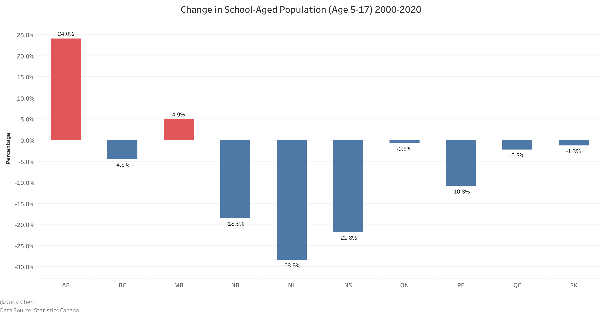

### School Type

When it comes to K-12 education in Canada, there are three distinctive avenues:

**Public Schools:** These vibrant hubs of knowledge, funded by the public, welcome students from every corner of the nation, free of charge. A whopping 90.7 percent of Canadian children choose this educational adventure.

**Independent Schools:** These institutions, privately owned and operated, beckon parents to invest in their children's education. Approximately 7.7 percent of Canadian students embark on this enriching journey, though tuition fees can vary widely.

**Homeschooling:** For those who seek a more personalized approach, homeschooling provides a unique path. Regulations vary across provinces, but parents often find a wealth of curriculum options and support online. About 1.6 percent of Canadian children embrace the freedom of homeschooling.

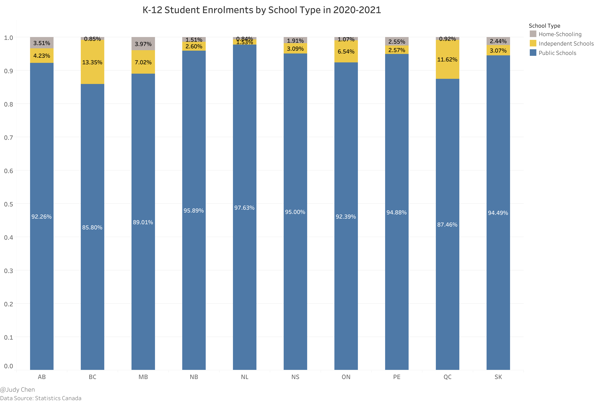

Peering into the educational landscape, public schools emerge as the undisputed stars, captivating 97.63 percent of Newfoundland & Labrador's students in the 2020-2021 school year. Meanwhile, British Columbia, with its diverse choices, registers a lower public school enrollment rate at 85.8 percent.

Moreover, British Columbia takes the lead in independent school enrollment, boasting 13.35 percent of students in this category, followed closely by Quebec at 11.62 percent. In contrast, the Atlantic Provinces feature notably lower levels of independent school enrollment.

Homeschooling, though a smaller piece of the educational puzzle, finds a niche in Manitoba, where 3.97 percent of students opt for this distinctive learning journey. In three provinces, homeschooling claims less than 1 percent of the student population.

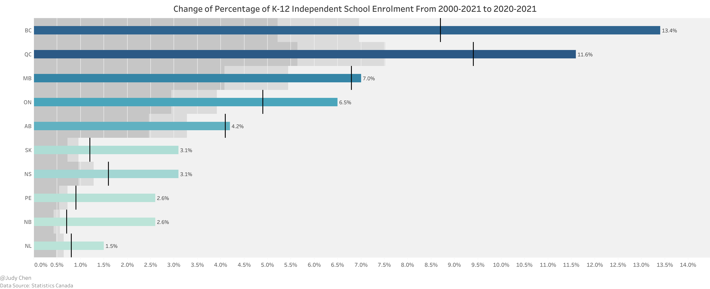

Over the past two decades, the landscape of education has evolved. Every province witnessed a surge in independent school enrollments, with British Columbia's numbers soaring from 8.7 percent to an impressive 13.4 percent, representing nearly one in every eight students. In contrast, Alberta's growth remained steady, inching from 4.1 percent to 4.2 percent over the same period.

## K-12 International Students

Fast forward to 2022, and the world of K-12 education in Canada welcomes an influx of international students. Over 65,200 students from around the globe choose Canada as their educational destination, marking a remarkable 44 percent increase from the previous year. While British Columbia experienced a 10 percent growth rate, Alberta stood as the hottest spot, with an impressive 83 percent surge in international student approvals.

What fuels this transformation? While the allure of metropolitan areas like Vancouver remains, factors like affordable housing, cost of living, and immigration policies take center stage for prospective international students.

In a surprising twist, elementary school student approvals eclipsed those of secondary students in 2022. This shift marks a significant change in the international education landscape, as historically, secondary students dominated. Elementary approvals witnessed a meteoric fivefold rise compared to their secondary counterparts.

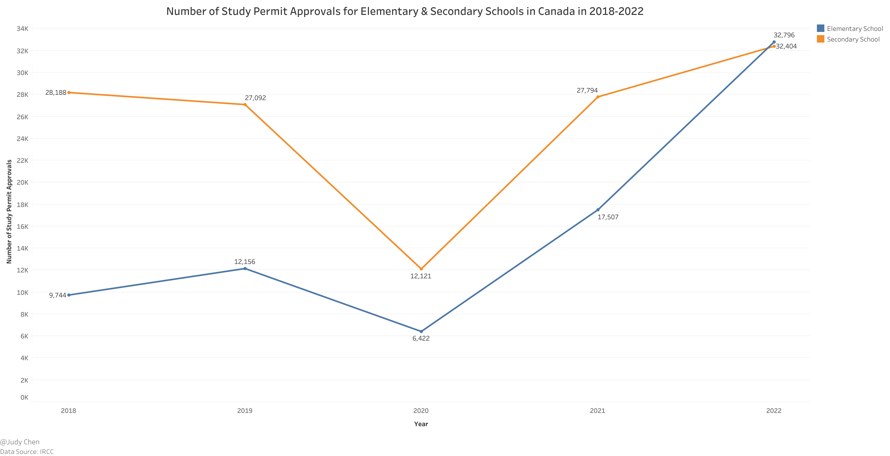

Peering into the origins of these eager young learners, India, Philippines, and China lead the pack. Among the top five origin regions, four hail from Asia, with Ukraine stealing the spotlight with over 3,300 elementary student approvals. This surge can be attributed to recent geopolitical conflicts in Europe and Canada's initiative to waive application fees for Ukrainian students.

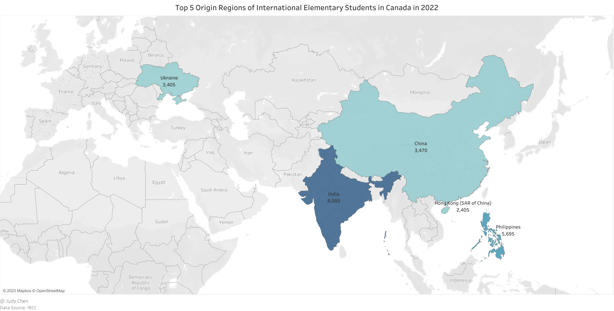

The story continues in the realm of secondary education. In 2022, China's flag flies high, with a significantly larger number of international secondary students compared to other regions.

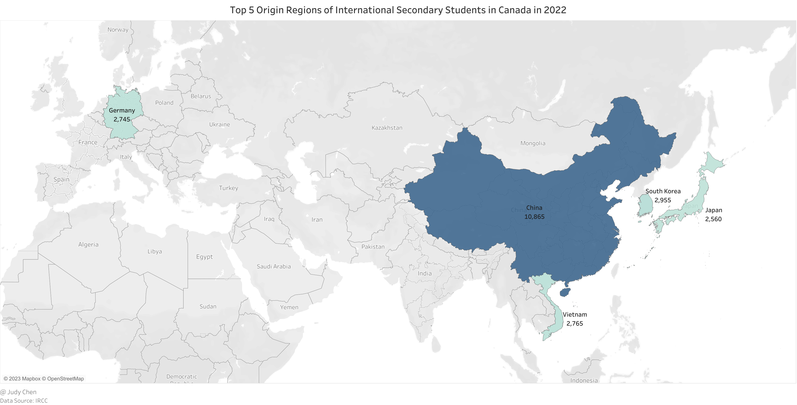

## K-12 Education in Metro Vancouver

### School Districts in Metro Vancouver

The educational landscape in Metro Vancouver, as per the BC Education System, comprises 11 distinct school districts, each with its unique flavor.

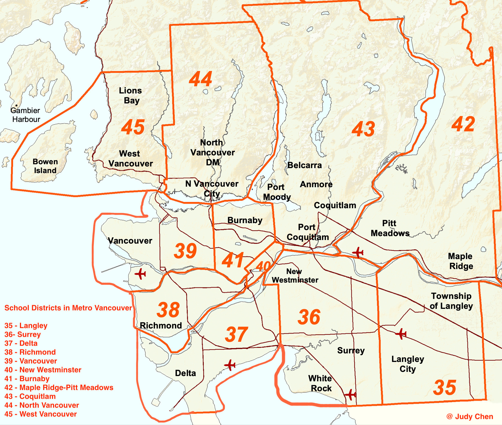

**Langley School District** - serving a diverse range, including Matsqui, Kwantlen, Katzie, Semiahmoo First Nations, the City of Langley, and the Township of Langley.

**Surrey School District** - serving the cities of Surrey and White Rock along with the rural area of Barnston Island

**Delta School District** - serving the Municipality of Delta including the three communities of Ladner, Tsawwassen, and North Delta

**Richmond School District** - serving the city of Richmond

**Vancouver School District** - serving the city of Vancouver and the University Endowment Lands

**New Westminster School District** - serving the city of New Westminster, including the beighbourhood of Queensborough on Lulu Island

**Burnaby School District** - serving the city of Burnaby

**Maple Ridge-Pitt Meadows School District** - serving the cities of Maple Ridge and Pitt Meadows

**Coquitlam School District** - serving the cities of Coquitlam, Port Coquitlam, Port Moody, along with the villages of Anmore and Belcarra

**North Vancouver School District** - serving the city of North Vancouver and District of North Vancouver

**West Vancouver School District** - serving the city of West Vancouver, the community of Lions Bay and Bowen Island

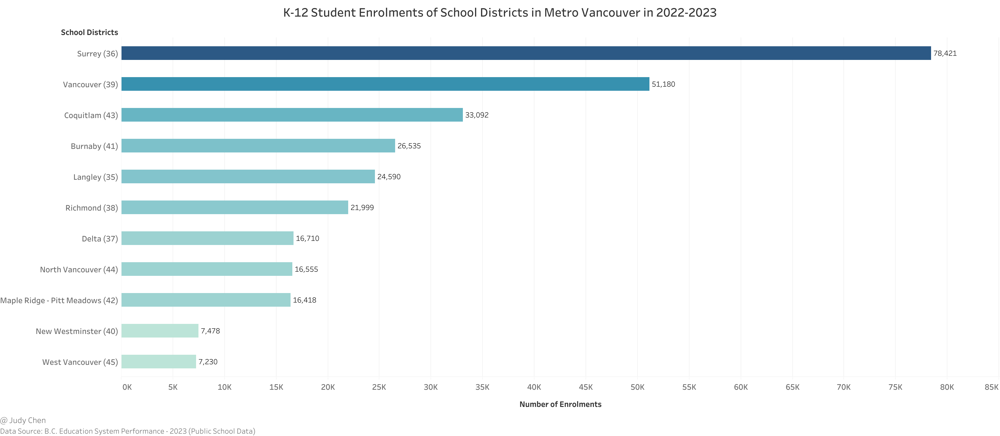

The number of K-12 students enrolled within different school districts in Metro Vancouver varies significantly. Surrey School District currently has the largest student enrolment (more than 78K) in BC and is one of the few growing districts in the province.

The above graph indicates that Surrey, Vancouver and Coquitlam were the top three school districts with the highest K-12 public student enrolments in Metro Vancouver in 2022-2023, while New Westminster and West Vancouver school distrcits had the lowest public student enrolments below 8K.

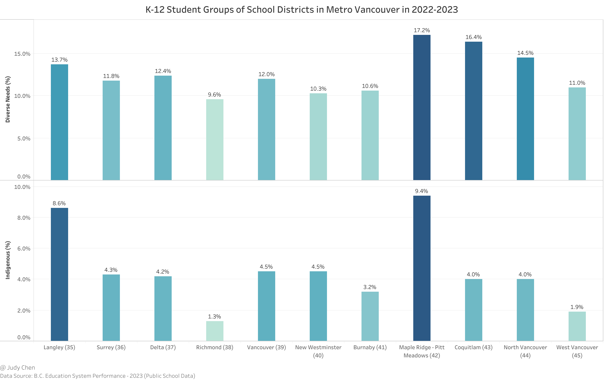

In 2022-2023, Maple Ridge-Pitt Meadows School District had the highest percentage either in Diverse Needs or Indigenous groups of K-12 public students, while Richmond School District had the lowest percentage in the both groups at the same time.

### Elementary School Ratings in Metro Vancouver

The Fraser Institute takes the stage, casting its spotlight on elementary schools in BC, evaluating them based on provincewide test results in reading, writing, and math. These tests, taken by students in grades 4 and 7, reveal the academic champions.

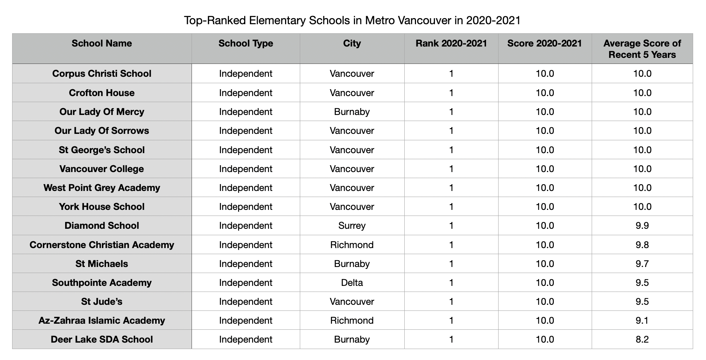

Among the 870 elementary schools ranked, a select 15 achieve a perfect 10-score, all nestled within the bustling heart of Metro Vancouver. Of these 15, eight grace the streets of Vancouver, three call Burnaby home, and two reside in Richmond.

But what about public schools? The table thickens.

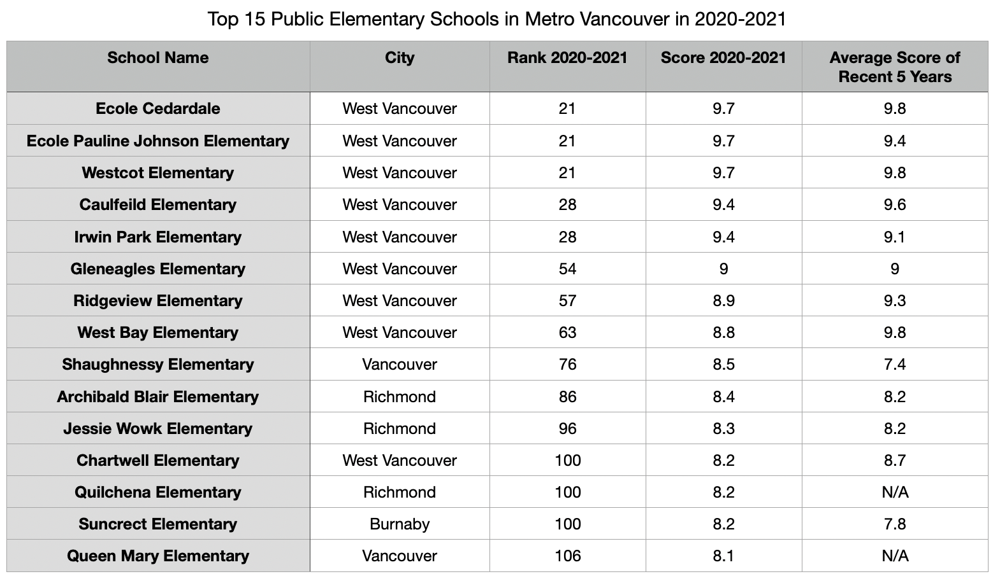

In a surprising twist, the top eight public elementary schools hail from West Vancouver, showcasing the district's dedication to excellence. Among the top 15 public elementary schools, nine proudly represent West Vancouver, three stand tall in Richmond, two call Vancouver home, and one claims Burnaby as its base.

Now, let's dissect the average scores of public elementary schools across different districts.

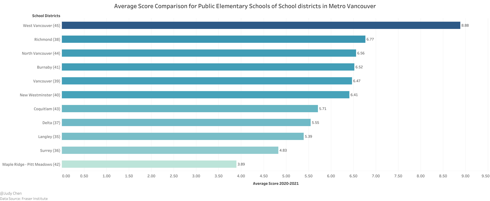

In a not-so-surprising revelation, West Vancouver School District emerges as the champion, boasting an impressive average score of 8.88, towering over the competition. Richmond School District follows closely with a score of 6.77, with North Vancouver School District hot on its heels at 6.56. On the flip side, Maple Ridge-Pitt Meadows and Surrey School Districts find themselves at the lower end of the scale, with average scores below 5. Notably, the South Surrey & White Rock region defies the district's average, scoring a commendable 6.40, despite Surrey School District's lower average.

### Secondary School Ratings in Metro Vancouver

The latest ratings of 252 secondary schools in BC, provided by the Fraser Institute, shine a spotlight on provincewide test results in language arts, math, and science, spanning grades 10, 11, and 12.

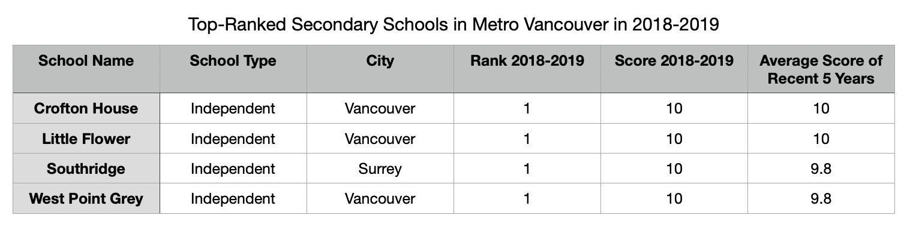

In this arena, four remarkable secondary schools earn a perfect 10-score. All four, independent in nature, grace the vibrant landscape of Metro Vancouver, with three nestled in Vancouver and one calling Surrey home.

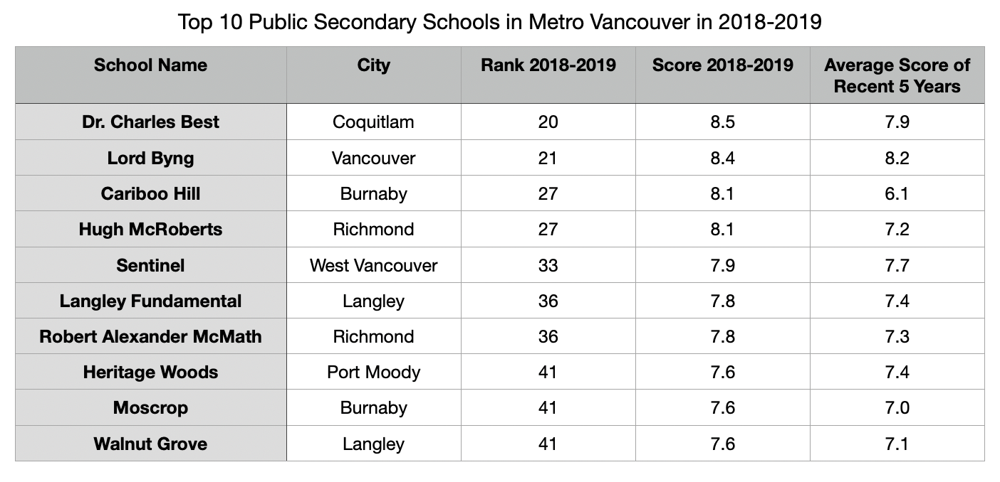

Unveiling the top 10 public secondary schools in Metro Vancouver, we discover a dispersed landscape, not as concentrated as the elementary scene. Burnaby, Richmond, and Langley each lay claim to two schools.

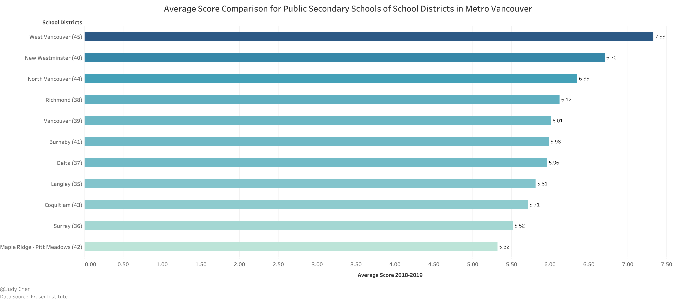

The average score comparison unveils West Vancouver School District as the undisputed academic kingpin, boasting an average score of 7.33. North Vancouver follows closely at 6.35, with Richmond rounding off the top three at 6.12. Meanwhile, New Westminster School District, with only one secondary school, charts an inconsequential average score.

Much like public elementary schools, Maple Ridge-Pitt Meadows and Surrey School Districts find themselves at the bottom of the ladder, with average scores trailing below 6. However, the South Surrey & White Rock region defies expectations once again, surging to a remarkable 6.60, falling just short of West Vancouver and New Westminster School Districts.

## Key Insights

As we conclude our exploration of K-12 education, a few key insights emerge:

* Independent schools are on the rise, with over 1/8 of K-12 students in BC now opting for this enriching experience, the highest rate in Canada.

* A seismic shift occurs as the number of international elementary students surpasses their secondary counterparts in 2022.

* Livable cities with a low cost of living are the new magnets, drawing international students in Canada.

* West Vancouver School District takes center stage as the top public school board, delivering a stellar academic performance in Metro Vancouver and BC.

* Surrey School District emerges as the largest K-12 student hub in BC, albeit with varying academic performance. Yet, the South Surrey & White Rock region shines as a beacon of academic excellence within.

* The age-old debate of independent vs. public schools continues, with a reminder that family income and parental education levels often play pivotal roles in the outcomes.

**
October 2023
**
