# Cost of Living in Vancouver

Vancouver, renowned for its breathtaking landscapes, robust small business atmosphere, and vibrant startup communities, consistently ranks as one of the most livable cities globally. Despite its allure, Vancouver has gained notoriety for being among the most expensive cities in Canada. In this article, we delve into the monthly expenditures for residents, whether they are individuals or families, offering a comprehensive breakdown of the cost of living in this picturesque city.

## Housing Cost

### Owning a Home

Acquiring real estate in Vancouver has become a widely discussed subject across Canada due to homes frequently selling well above the asking price. In November 2023, the average price for detached houses in Metro Vancouver stood at approximately `$2.12` million. Apartments, too, command a hefty price tag, with an average sale price of around `$794,000`. 

Data from the Canada Mortgage and Housing Corporation (CMHC) reveals that the average monthly mortgage payment in Vancouver reached `$2,323` in Q2 2023, and due to the high mortgage rate, the average monthly mortgage payment for new mortgage loans in Vancouver has reached `$2,992` in Q2 2023.

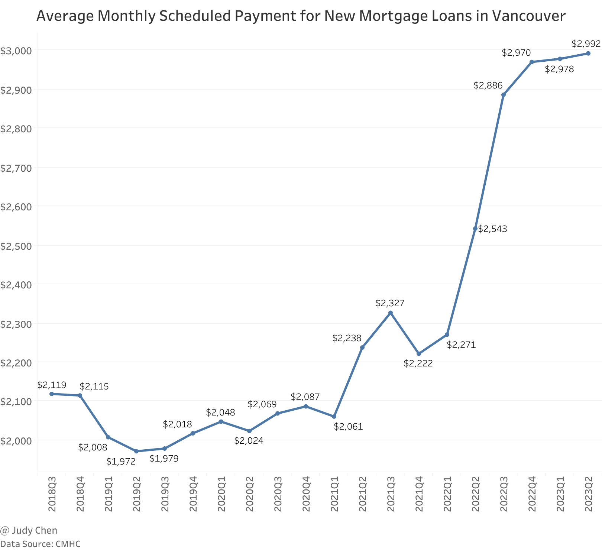

Considering additional costs such as homeowner's insurance, annual property maintenance, and property taxes, owning a home with a mortgage in Vancouver could easily surpass `$3,000` per month on average.

### Renting a Home

Given the exorbitant housing market, many Vancouverites opt for renting. Rental costs vary based on location, number of rooms, and square footage. Median rental prices for different types of apartments in Vancouver are outlined below.

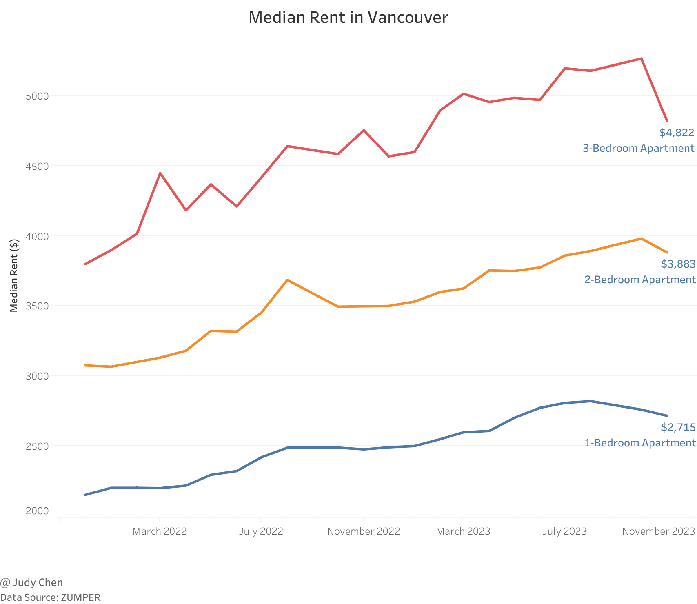

## Utilities Cost

When dissecting utility expenses, factors like electricity, gas, water, garbage, internet, cable, and home phone need consideration, wherein some may be included in your rent, some may not. According to data from [movingwaldo](https://www.movingwaldo.com/daily-living/bc-utility-bills-how-much-does-utilities-cost/), the average monthly utilities cost in Vancouver is `$319`.

## Transportation Cost

The cost of transportation will greatly differ depending on whether you opt to take public transport or use your own vehicle.

### Public Transport

With parking being tough in the city core, public transport is one option to get around. Navigating the city is facilitated by Translink, Metro Vancouver's transportation authority. Public transit options include buses, skytrains, seabus, and the West Coast Express commuter train service.

As shown below, a monthly pass for Translink ranges from `$104.9` to `$189.45`, depending on what zone of Vancouver you plan on commuting in.

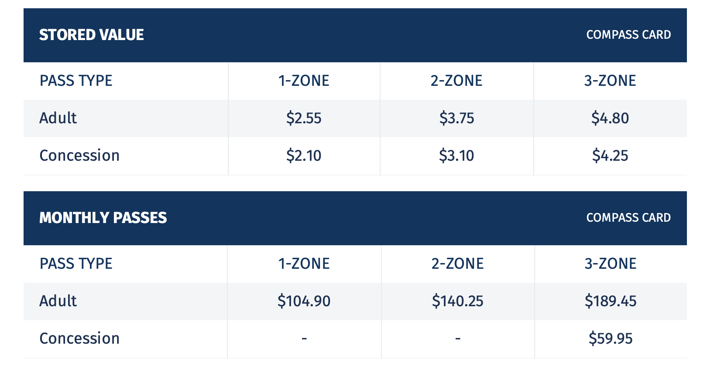

### Owning a Car

While public transport is a viable option, owning a car incurs additional expenses such as car finance payments, gas, insurance, maintenance, parking, and emergency repairs.

#### Car finance payment

Based on data from [finder](https://www.finder.com/ca/what-is-the-average-car-payment), the average monthly car payment for new vehicles in BC was `$957` in December 2022.

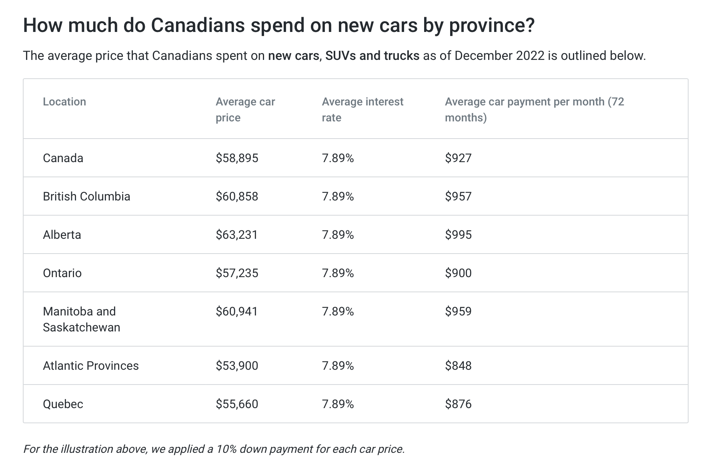

Used cars typically come with higher interest rates than new cars, but they also have lower prices, so your monthly payments is likely to be lower. And lease payments are generally less expensive than financing payments on a new car.

#### Gas

Metro Vancouver has the highest gas price in Canada, averaging between `$100` and `$300` per month depending on factors like fuel economy and distance traveled.

#### Insurance

Basic car insurance in BC is regulated and provided by the Insurance Corporation of British Columbia (ICBC).  Unfortunately, BC holds the first place for most expensive car insurance rates in Canada, coming at more than `$150` per month on average.

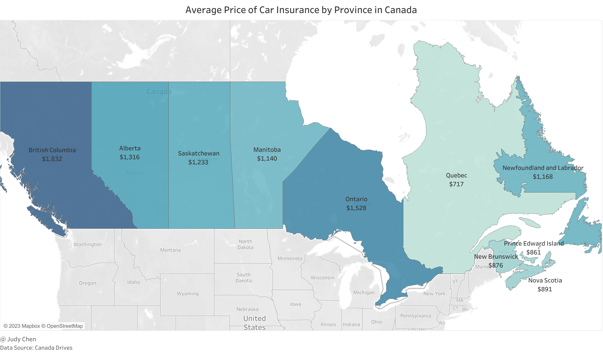

#### Routine Maintenance

Annual routine maintenance, including oil changes, tire rotations, filter replacements and other repairs that keep your vehicle running smoothly, may range from `$200` to `$1,000`.

#### Parking

Your own parking expense will vary, as it could be particularly low or high depending on where you keep your car when you're not using it. If you live outside of the city core, parking expenses may not be much of a consideration. But if you live or work within the city core, it can be a major expense.

Parking expenses vary, with rates between `$200` and `$300` per month in Vancouver, particularly in the city core.

#### Emergency Repairs

Emergency repairs can cost several hundred to several thousand dollars, depending on the damage.

In conclusion, even with full car payment, the monthly cost of owning a car ranges from `$400` to `$600` on average, significantly higher than the cost of public transport. And if financed, the cost may escalate to around `$1,000` per month.

## Food Cost

Food can take up a large part of your budget and is sometimes your second or third largest expense after housing and taxes. In recent years, there has been a noticeable increase in the price of groceries. According to **Canada's Food Price Report 2023**, the annual cost of groceries for a Canadian family of four with an adult male (31-50), an adult female (31-50), a boy (14-18) and a girl (9-13), is projected to reach `$16,288.41` in 2023 at the national average.

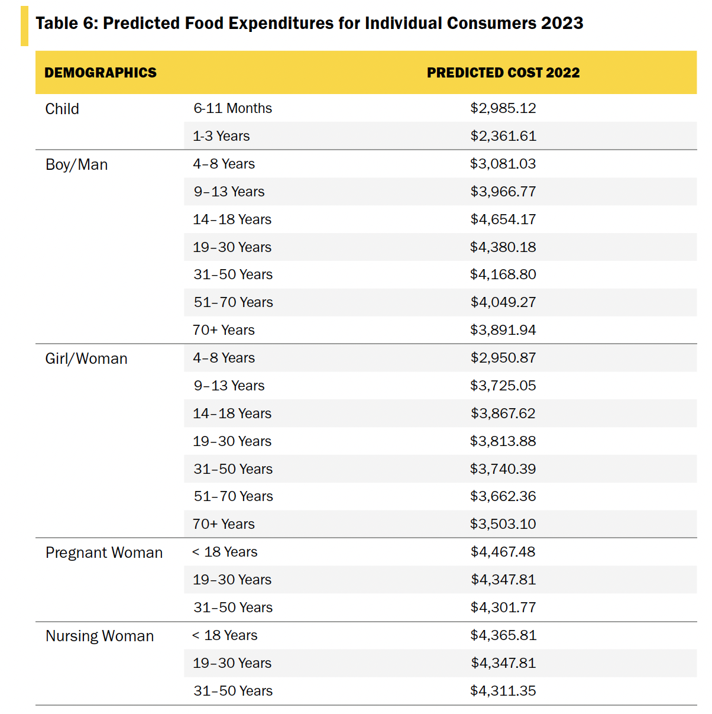

As we all know, food is not a fixed expense like rent. The amount you pay for groceries will depend on many factors, such as what you eat, where you live, and whether you cook or dine out. Obviously, food price in Vancouver is greatly higher than the national average level. Generally, in Vancouver, monthly expenses for groceries per adult are estimated at `$400`, excluding alcohol or cigarettes.

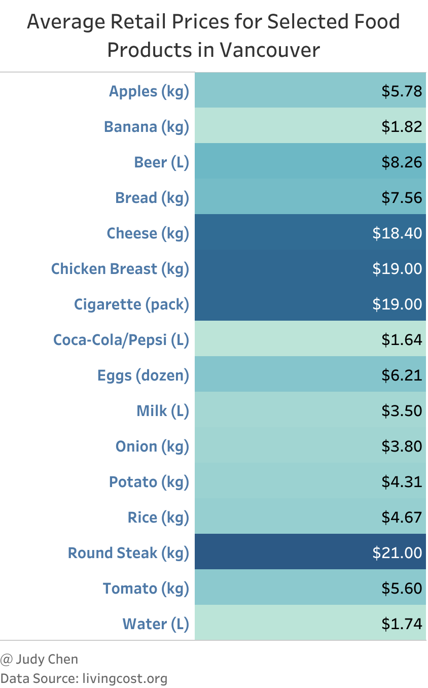

Dining out and takeaway food will, of course, cost you more. The average cost varies greatly based on how frequently you eat out, and your taste in restaurants. For example, a meal at an inexpensive establishment will set you back only `$20` per person, whereas the bill for one person dining at a mid-range restaurant will be around `$40`. So, if you were to order in or dine out four times a month, you would spend between `$80` and `$160`.

Based on the above, the total average cost of food in Vancouver may range from `$480` to `$560` per month.

## Entertainment and Fitness

Considering the essentials only, the average cost of entertainment around the city of Vancouver includes:

* Cinema Ticket: `$15`

* Ticket of sports game or show: `$50`

* Haircuts: `$20`

* Gym Memberships: `$55`

Basically, if you visit the cinema once, attend one sports game or a show once, have a haircut once per month, and join a fitness membership, your monthly leisure costs would be approximate `$140`.

## Education

Education costs in Vancouver vary by institution type, with monthly expenses for childcare estimated at `$802`, free tuition for K-12 public schools (Canadian residents only), K-12 private schools averaging `$22,000` annually, and post-secondary schools averaging from `$6,000` to `$8,000` annually.

## Average Monthly Cost of Living in Vancouver

Now, we can calculate the average monthly cost of living in Vancouver using the provided data, and finding the total sum which may vary from one person to a family.

### A Single Person

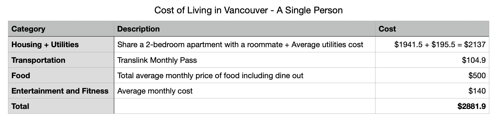

The average monthly cost of living in Vancouver for a single person is approximately `$2,881.9`. Comparatively, the average monthly net salary after tax in Vancouver is about `$4,087`, providing enough coverage for about 1.4 months of living expenses.

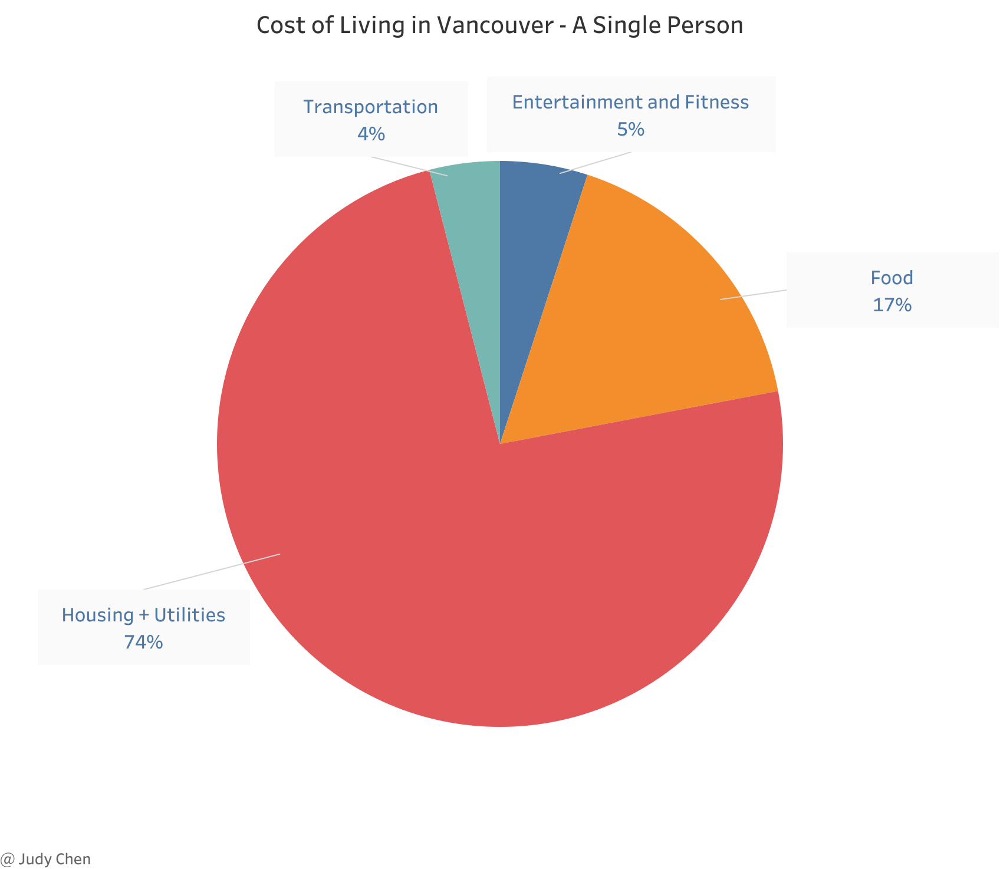

### A Family of Four

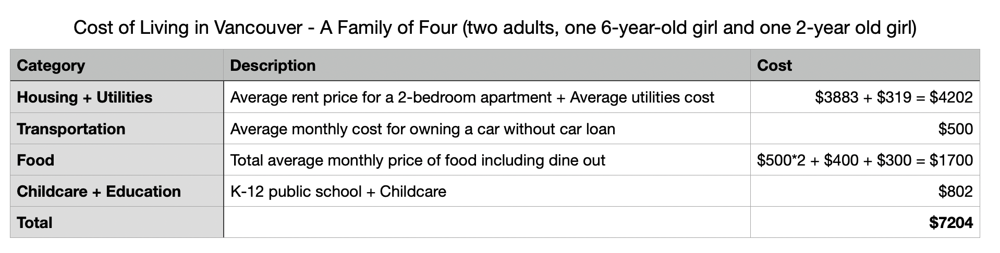

> If you are sharing cost with someone, it will be significantly lower. Also, if you are budgting for a family, you'll need to add the cost of each family member. The above calculated cost is an approximation. Cost may vary based on different conditions.

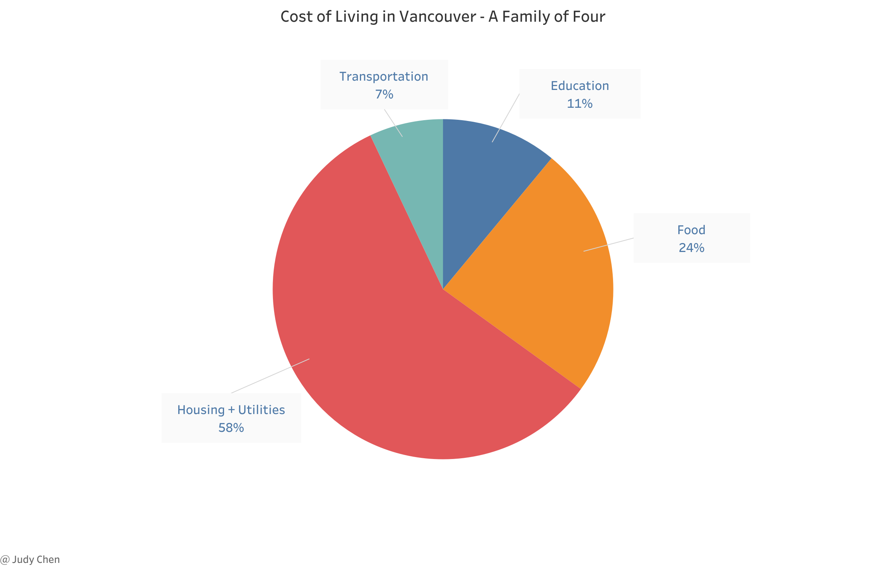

The average monthly cost of living in Vancouver for a family of four is approximately `$7,204`, wherein the cost of Education can vary a lot based on the age of kids and institution type. For example, you do not need to pay when both kids study in a K-12 public school, by contrast, you may have to pay more than `$40,000` per year when both kids study in a K-12 private school.

### Comparison with Other Cities

Finally, let's compare Vancouver with the other cities in the world based on the cost of living.

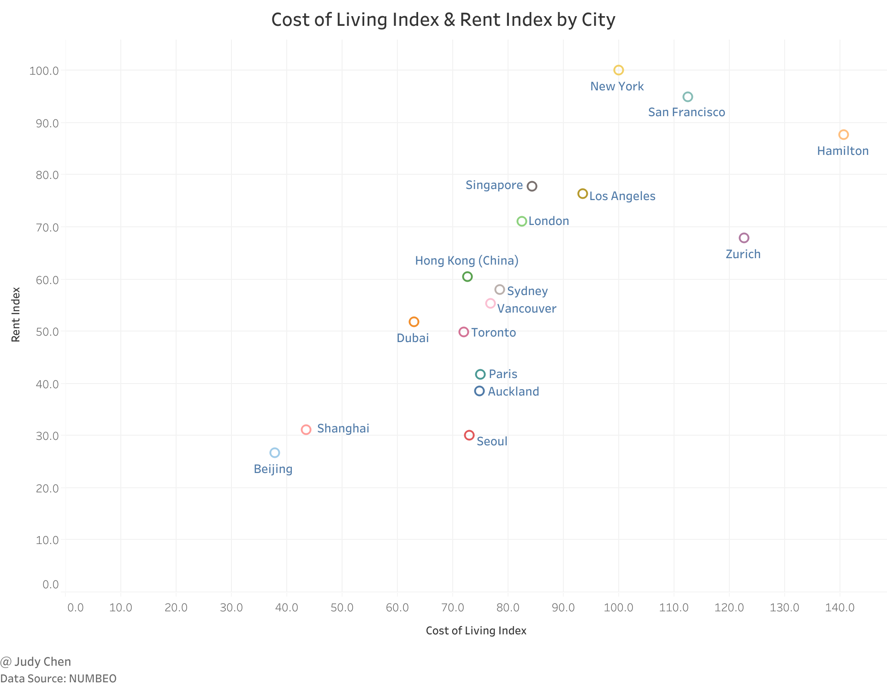

> **Cost of Living Index** indicates the relative prices of consumer goods like groceries, restaurants, transportatin, and utilities. It excludes accommodation expenses such as rent or mortgage.

According to the above figure, Vancouver's average rental price is approximately 44.5% lower than that of New York City. The overall cost of living (excluding rent) in Vancouver is approximately 24.1% lower than in New York City. Despite these relative advantages, Vancouver remains among the most expensive cities globally.

**
December 2023
**