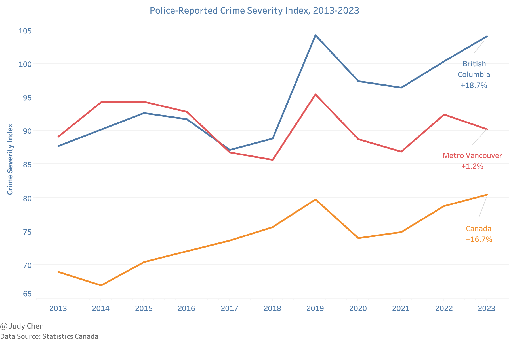
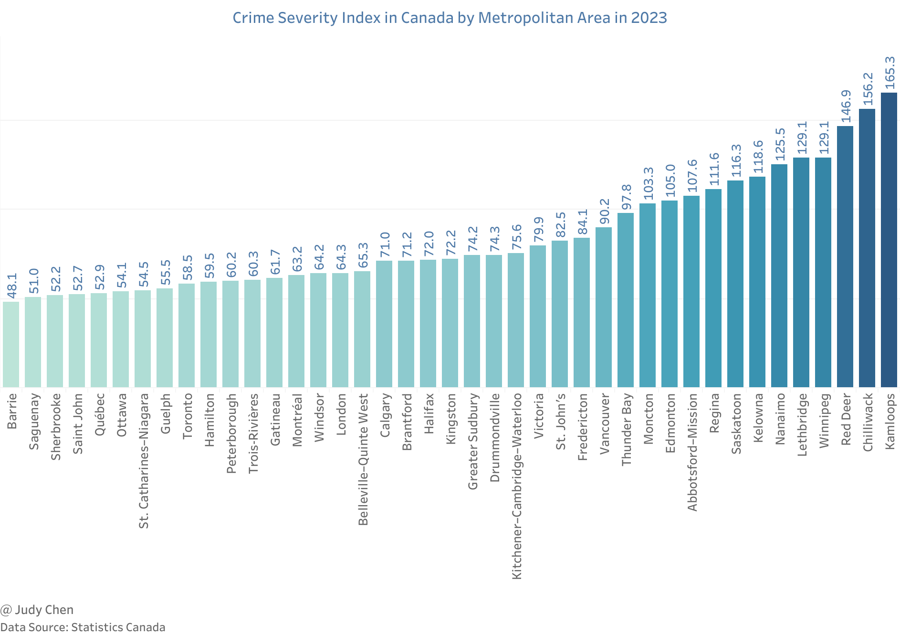
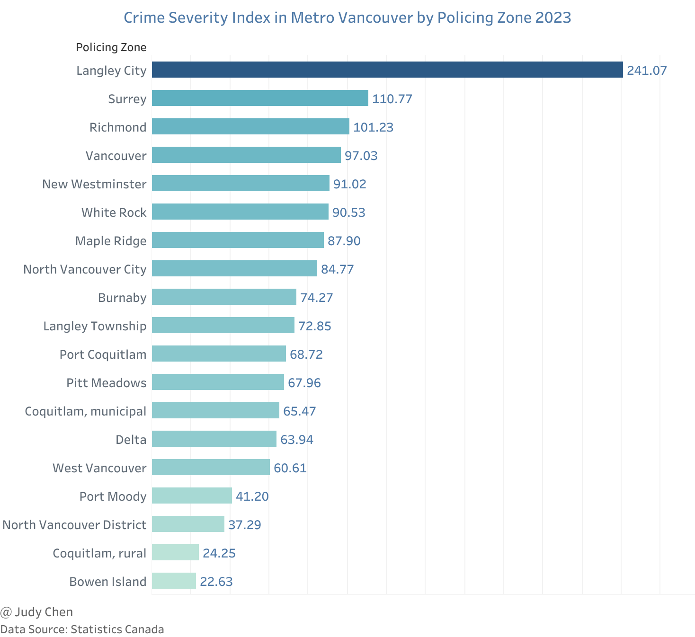
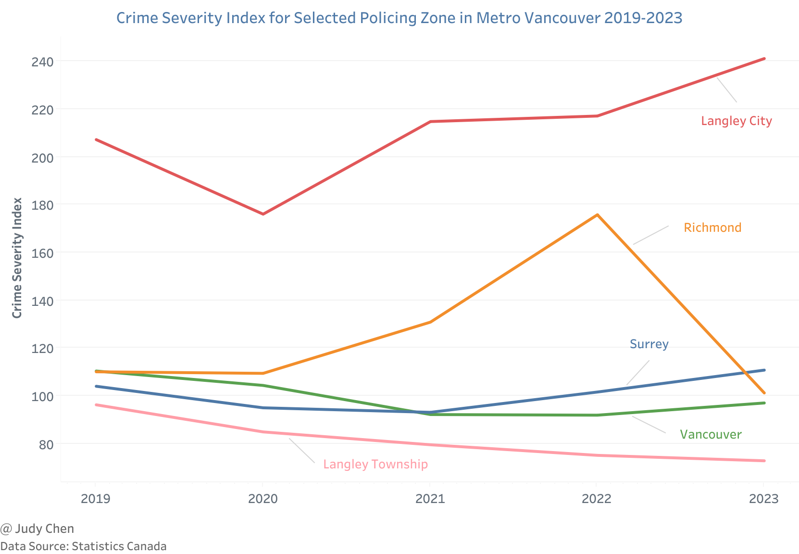
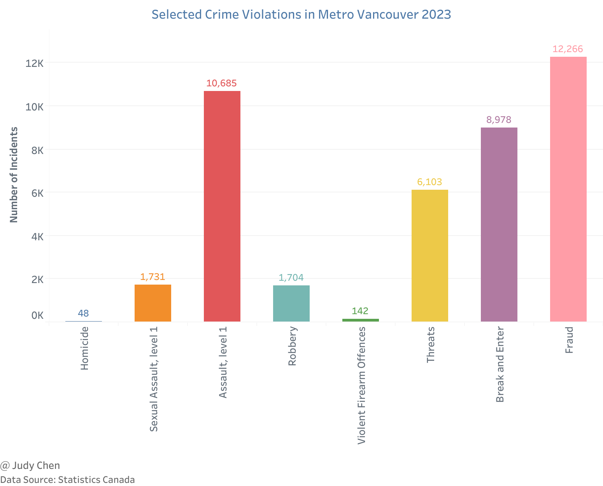
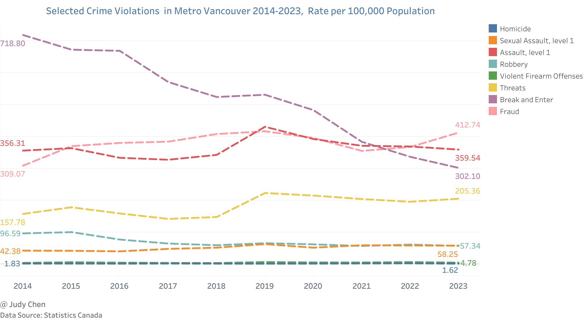
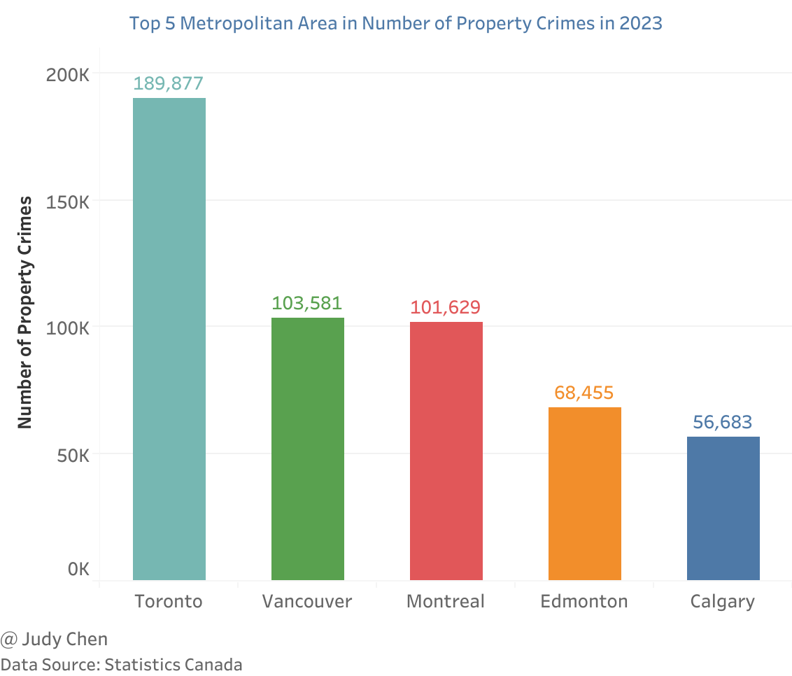
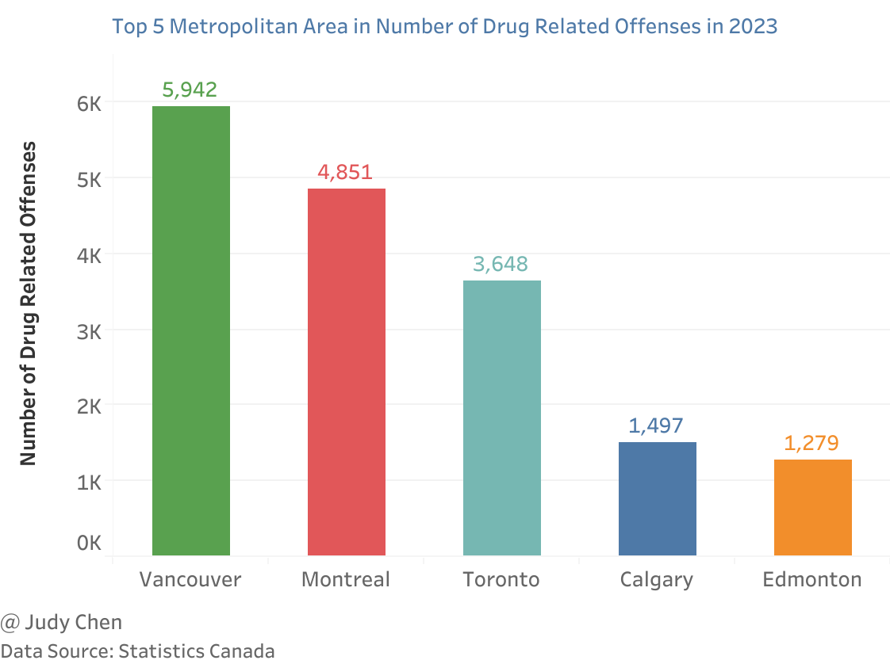

# Crime Statistics in Vancouver 2023

Crime statistics are a valuable tool for criminal justice professionals in identifying areas of increased crime risk. By analyzing these trends, law enforcement can proactively implement measures to prevent potential crimes. In this article, the Crime Severity Index (CSI) is used to examine crime trends in Metro Vancouver.

## Crime Severity Index

The Crime Severity Index measures both the frequency and severity of crimes. It was developed to complement traditional crime rates and self-reported victimization data, providing a more comprehensive view of criminal activity.

### Crime Severity Index Changes 2013-2023

#### Key Findings

* The CSI in Canada increased for the third consecutive year, rising by 2% in 2023, reaching its highest value in the last decade.

* From 2013 to 2023, Canada's CSI rose by 16.7%, from 68.92 to 80.45. In British Columbia, it increased by 18.7%, from 87.71 to 104.11, while in Metro Vancouver, it saw only a slight rise of 1.2%, from 89.12 to 90.23.

* Since 2017, the CSI in British Columbia has surpassed that of Metro Vancouver and continues to do so.

### Geographical Distribution of Crime Severity Index 2023

#### Key Findings

* In 2023, British Columbia’s CSI was 104.1, ranking 8th among the 13 provinces and territories.

* The Northwest Territories experienced the most severe crimes, with the highest CSI at 473.7, followed by Nunavut (429.1), and Yukon (218.8), nearly half of Nunavut’s index.

* Ontario had the lowest CSI in 2023, at 60.9, followed closely by Quebec with 62.2.

* Metro Vancouver’s CSI was 90.2 in 2023, reflecting a 2% decrease compared to 2022. It ranked 28th among the 41 metropolitan areas.

* Kamloops had the highest CSI among the 41 metropolitan areas, at 165.3, followed by Chilliwack at 156.2, a 24% increase from 2022.

* In Metro Vancouver, Langley City had the highest CSI at 241.07 in 2023 — more than double that of Surrey (110.77). Richmond followed with a CSI of 101.23.

* Langley Township had a moderate CSI of 72.85, significantly lower than Langley City.

* Bowen Island had the lowest CSI in the region, at just 22.63, indicating the highest level of safety.

* Between 2019 and 2023, Langley Township’s CSI decreased by 24.3%, while Langley City’s dropped by 15% in 2020 before rising by 37% over the following three years.

* Since 2021, Surrey has surpassed Vancouver in terms of CSI, taking second place in the region.

* Richmond’s CSI saw the most fluctuation, with a 19.6% rise in 2021, a 34.3% increase in 2022, and a dramatic 42.4% drop in 2023.

## Crime Violations

### Crime Violations in Metro Vancouver

#### Key Findings

* n 2023, property crime accounted for 53.9% of all reported crimes in Metro Vancouver, violent crimes made up 17.6%, and drug-related violations represented 3.1%.

* There were 12,266 reported fraud incidents in 2023, an increase of 12.3% from 2022. This was followed by 10,685 cases of Level 1 assault and 8,978 break-and-enter incidents.

* Homicides dropped by 36.9% in 2023, with 48 incidents reported. Meanwhile, violent firearm offenses decreased by 25.9%, with 142 cases reported.

* Since 2014, the break-and-enter rate per 100,000 residents in Metro Vancouver has fallen from 718.80 to 302.10. In contrast, the fraud rate has risen from 309.07 to 412.74, overtaking break-and-enter incidents since 2022.

* The rate of threats per 100,000 residents increased from 157.78 to 205.36 between 2014 and 2023, while robbery rates fell from 96.59 to 57.34.

### Geographical Distribution of Selected Crime Violations 2023

#### Key Findings

* Toronto reported the highest number of property crimes in 2023, with 189,877 incidents. Metro Vancouver followed with 103,581 property crimes—just over half of Toronto’s figure.

* Metro Vancouver recorded the highest number of drug-related offenses in 2023, with 5,942 cases, followed by Montreal (4,851) and Toronto (3,648).

## Conclusion

In 2023, Metro Vancouver experienced diverse crime trends, with fluctuations in both the Crime Severity Index and specific types of violations. While property crimes remained a significant portion of overall crime, violent crime rates, including homicides and firearm offenses, showed notable decreases. The CSI in Metro Vancouver remained relatively stable compared to the larger increases seen in other areas of British Columbia and across Canada. However, certain regions within Metro Vancouver, such as Langley City and Surrey, exhibited rising crime severity, whereas others like Bowen Island demonstrated much lower crime rates, reflecting the varied nature of crime distribution in the area.

These findings highlight the importance of continuous monitoring and localized intervention strategies to address crime dynamics effectively and maintain public safety across the region.

**
October 2024
**