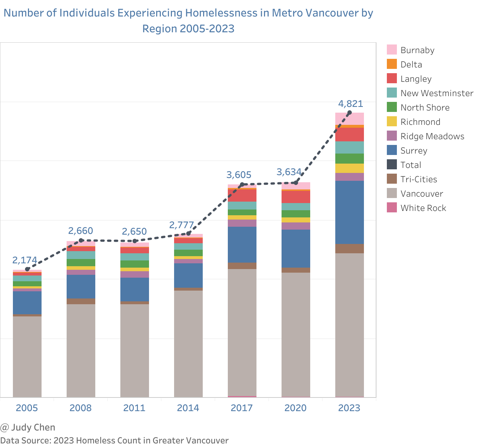
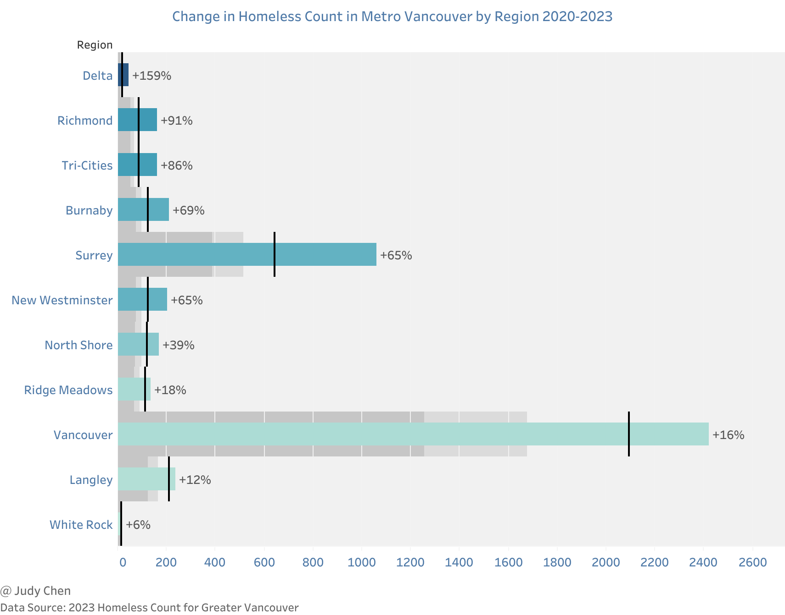
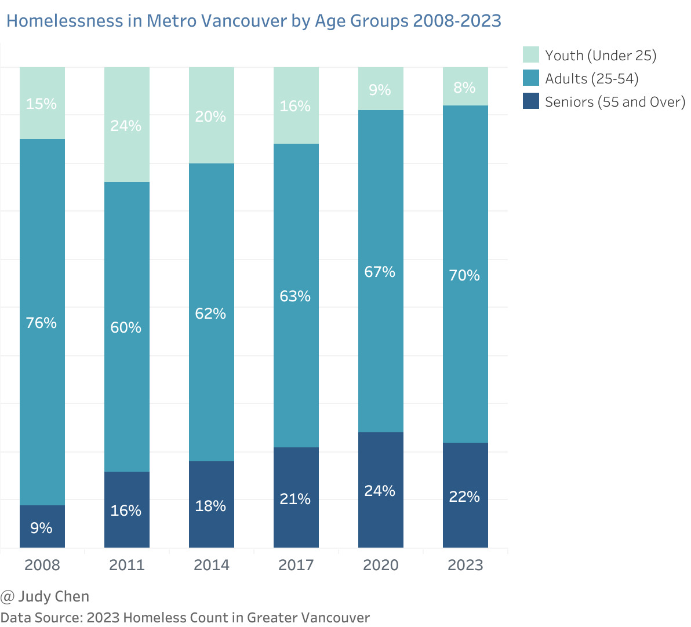
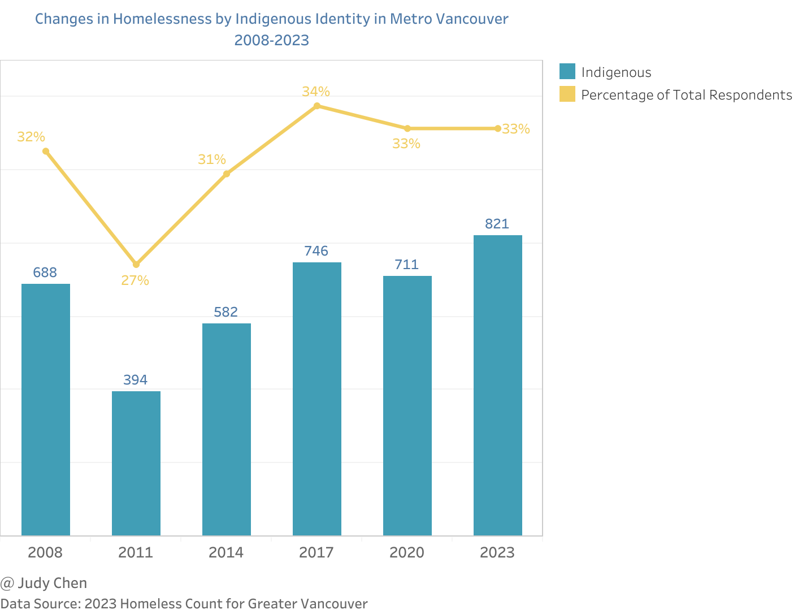
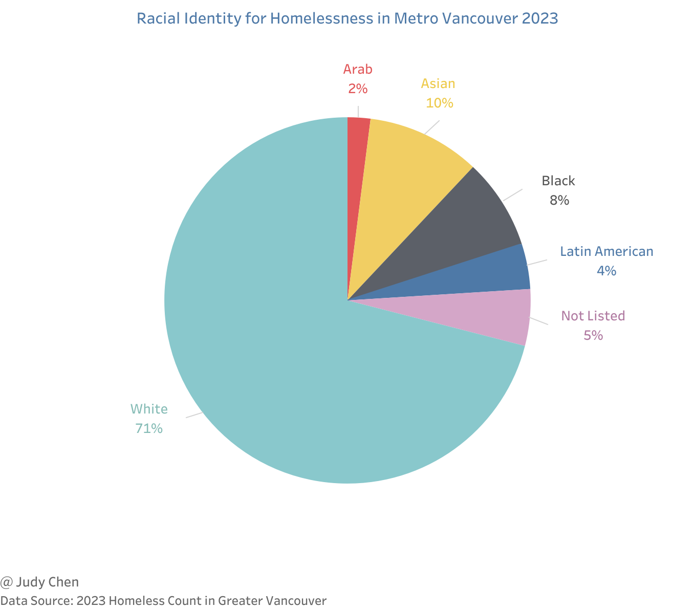
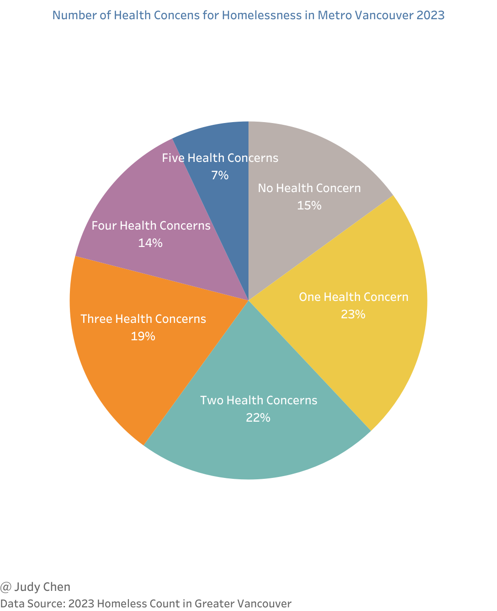
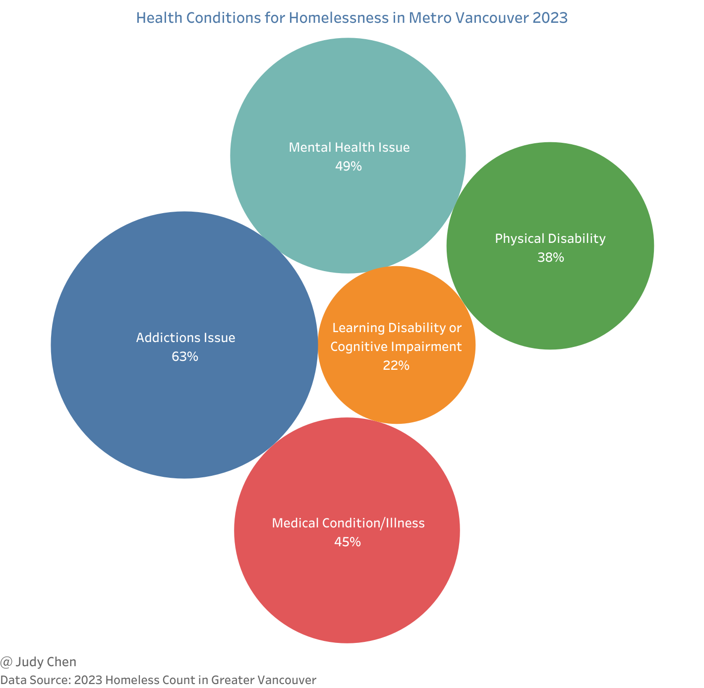
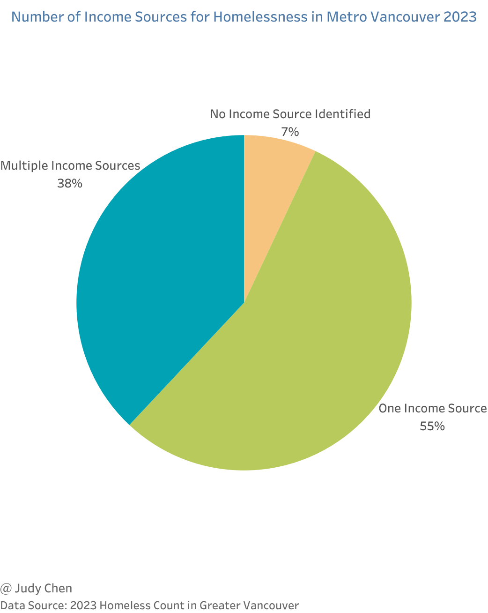
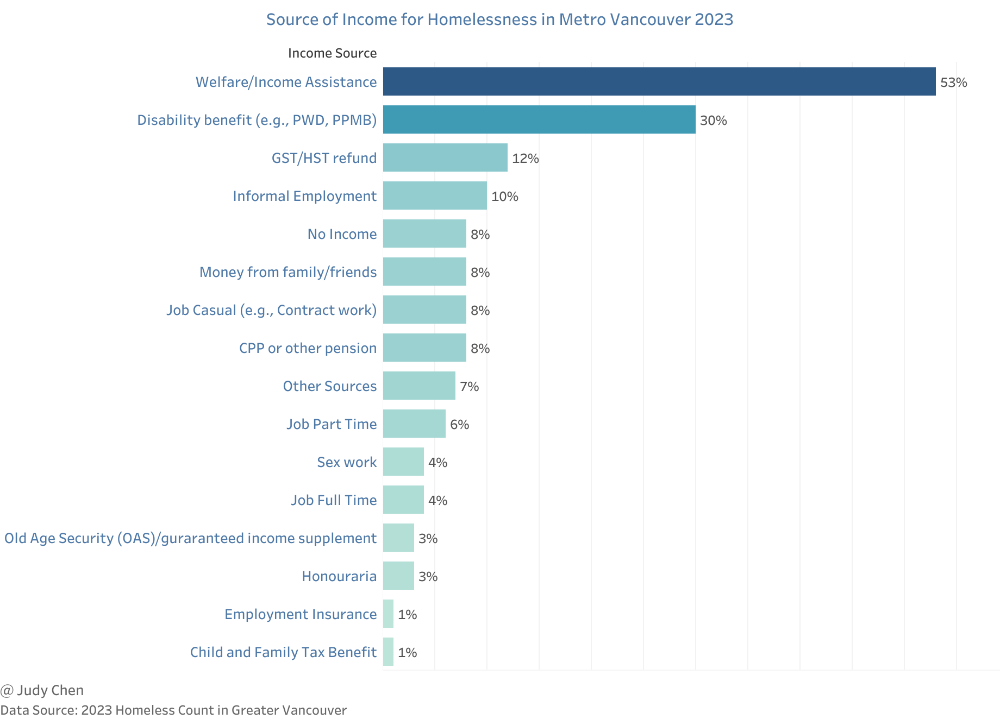
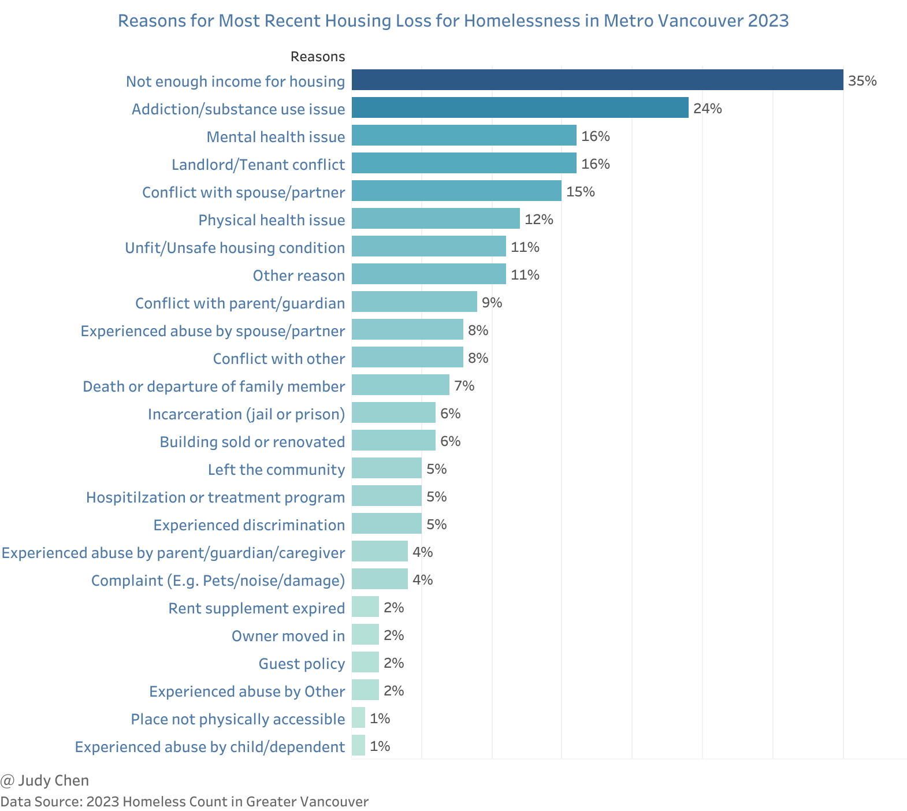

# Homelessness in Vancouver 2023

The issue of homelessness has reached critical proportions in Metro Vancouver, impacting urban, suburban, and rural areas alike. This article delves into the evolving landscape of homelessness, drawing insights from the [2023 Homeless Count in Greater Vancouver](https://hsa-bc.ca/_Library/2023_HC/2023_Homeless_Count_for_Greater_Vancouver.pdf) conducted by the Homelessness Services Association of BC.

## The Magnitude of Homelessness

It's crucial to acknowledge that any count of homelessness represents an underestimation. The figures provided by the PiT Methodology offer a snapshot, but individuals accessing services and shelters are more likely to be accounted for than those who are not.

> And for the region indicated in the article, the North Shore includes North Vancouver District, North Vancouver City and West Vancouver, Langley includes Langley City and Langley Township, Tri-Cities includes Port Coquitlam, Port Moody and Coquitlam, Ridge Meadows includes Maple Ridge and Pitt Meadowns.

### Key Findings

* In 2023, Metro Vancouver recorded 4,821 individuals experiencing homelessness, a substantial increase from 3,634 in 2020—a nearly 33% rise over three years, marking the most significant spike since 2005.

* The City of Vancouver continued to bear the brunt, hosting approximately 50% of the region's homeless population in 2023, down from 63% in 2005.

* All regions within Metro Vancouver saw an uptick in homelessness figures from 2020, with Delta, Richmond, and the Tri-Cities witnessing particularly sharp increases of 159%, 91%, and 86%, respectively.

* Surrey experienced the largest numerical surge, adding 416 homeless individuals from 2020 to 2023, comprising nearly 22% of Metro Vancouver's total homeless population in 2023.

* Among the homeless population, 30% (1,461) reported being unsheltered, while 70% (3,360) sought shelter, including 6% (300) in extreme weather response shelters in 2023.

## Demographic Profile of Homelessness

### Age Distribution

#### Key Findings

* The majority of homeless individuals in 2023 fell within the 25-54 age bracket, though 8% were under 25 years old.

* The proportion of youth experiencing homelessness declined steadily from 24% in 2011 to 8% in 2023, while seniors' representation rose from 9% in 2008 to 22% in 2023.

* Nearly half (47%) of respondents reported first experiencing homelessness as youth.

### Indigenous Representation

#### Key Findings

* In 2023, 821 respondents identified as Indigenous, maintaining a consistent proportion of 33% compared to 2020, though the total count of Indigenous individuals increased due to overall survey participation.

* Indigenous persons remained disproportionately represented in the homeless population, contrasting sharply with their 2.4% share of Metro Vancouver's population in the 2021 Census.

### Racial Diversity

#### Key Findings

* White individuals constituted the majority (71%) of the homeless population in 2023, followed by Asian (10%) and Black (8%) individuals.

* Notably, a significant portion (32%) of Asian homeless individuals were of South Asian descent, while African individuals comprised 44% of the Black homeless population.

### Duration of Homelessness

#### Key Findings

* The proportion of individuals experiencing homelessness for over a year surged to 69% in 2023, up from 45% in 2020, while those homeless for less than six months dropped to 20%, the lowest since 2008.

### Health Challenges

#### Key Findings

* In 2023, over 60% of respondents reported two or more health concerns, with addiction issues (63%) topping the list, followed by mental health issues (49%) and medical conditions (45%).

* Mental health issues saw a notable increase from 35% in 2011 to 49% in 2023, paralleling a rise in addiction issues from 54% to 63% during the same period.

### Sources of Income

#### Key Findings

* Despite income inadequacy being a primary cause of homelessness, 93% of respondents reported at least one income source, with 38% citing two or more.

* Welfare/income assistance remained the most common income source (53%), while 10% reported either full or part-time employment.

### Factors Contributing to Homelessness

#### Key Findings

* Lack of income (35%) emerged as the leading cause of housing loss in 2023, followed by addiction/substance use issues (24%) and mental health issues (16%).

* The COVID-19 pandemic was cited by 15% of respondents as a reason for recent housing loss.

### Sheltering Patterns

#### Key Findings

* In 2023, 79% of respondents reported spending at least one night in a homeless shelter, while 51% resorted to unsheltered locations, and 41% engaged in someone else's place or couch surfing.

* Additionally, 20% reported spending nights in vehicles.

## Conclusion

While the data sheds light on homelessness trends, it's vital to recognize the inherent limitations in capturing the full extent of the issue. Addressing homelessness requires multifaceted approaches, including improved access to medical care, expanded shelter infrastructure, and policy measures such as raising the Old Age Security (OAS) pension. By understanding the complexities of homelessness, we can work towards meaningful solutions to improve the lives of those affected.

**
April 2024
**