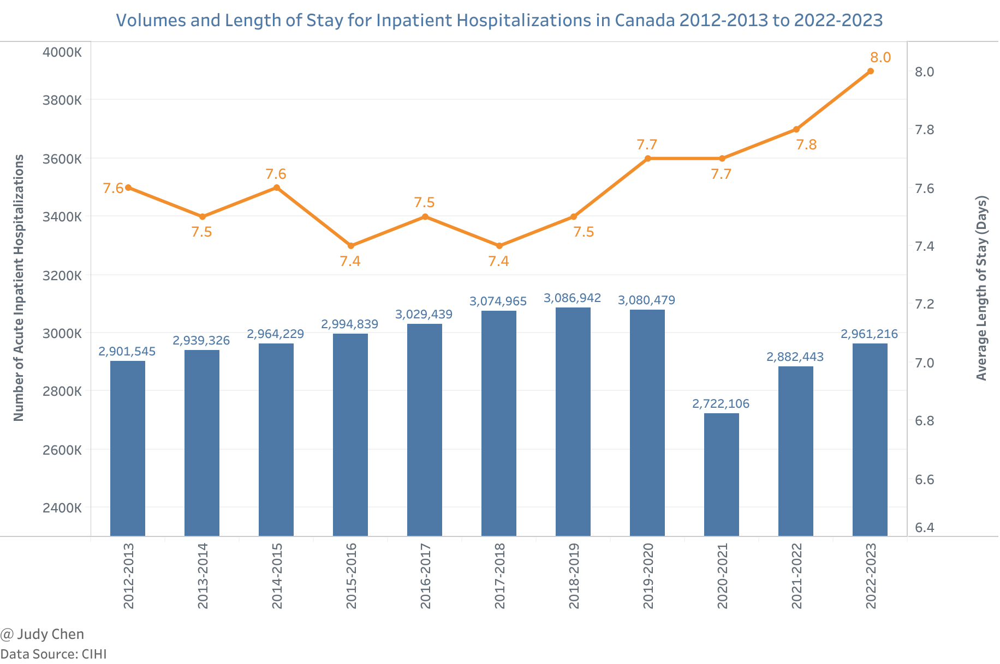
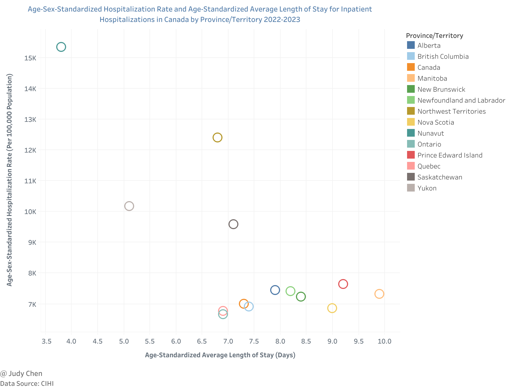
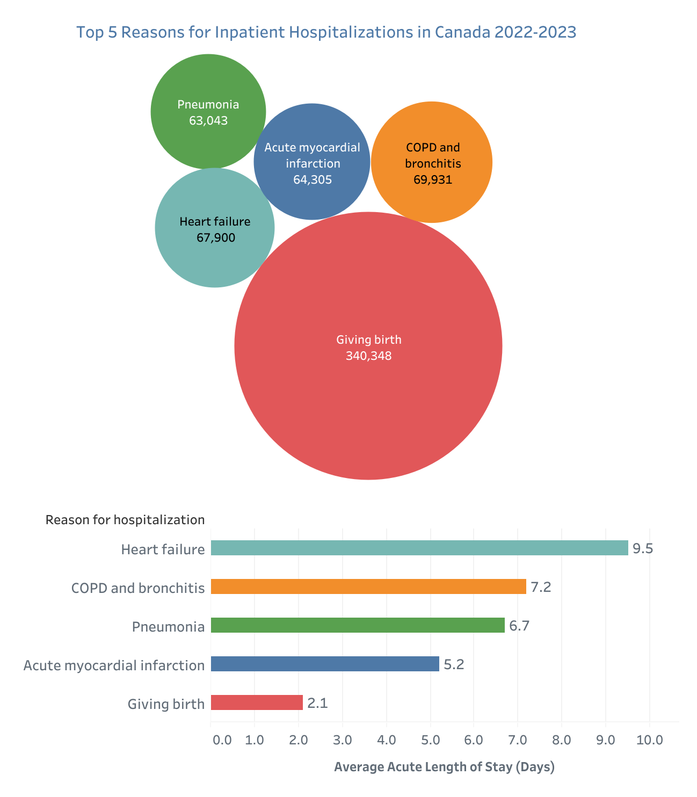
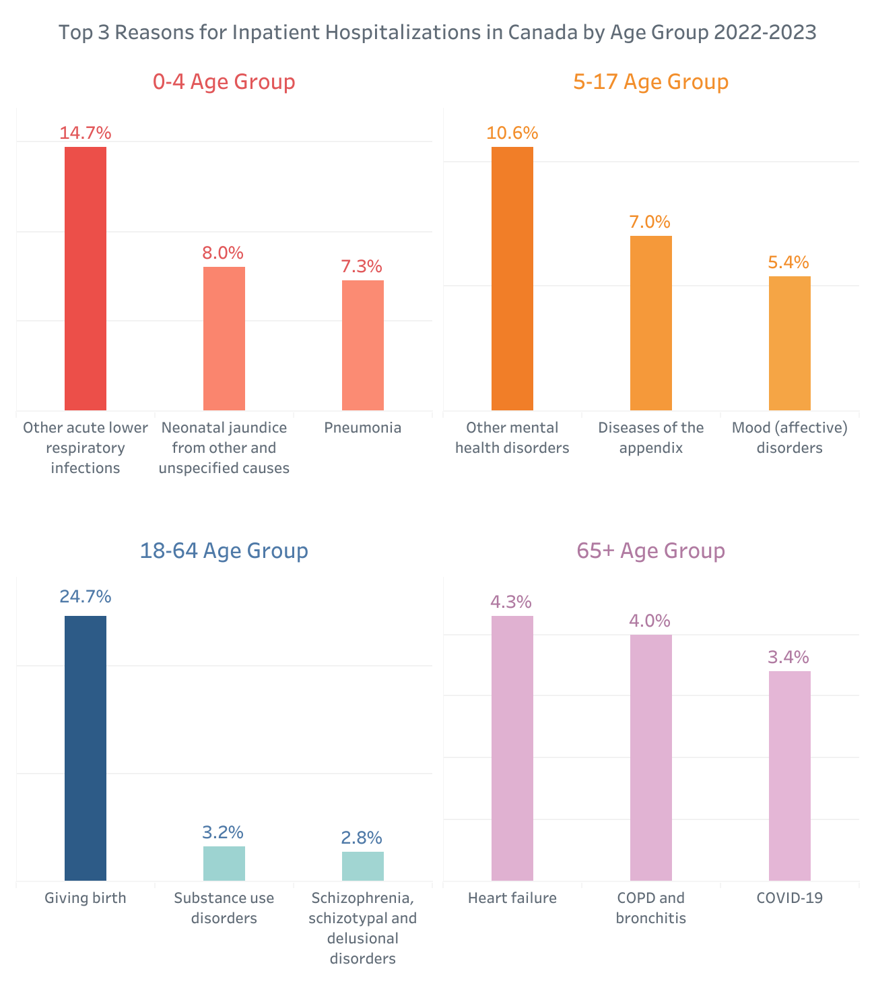
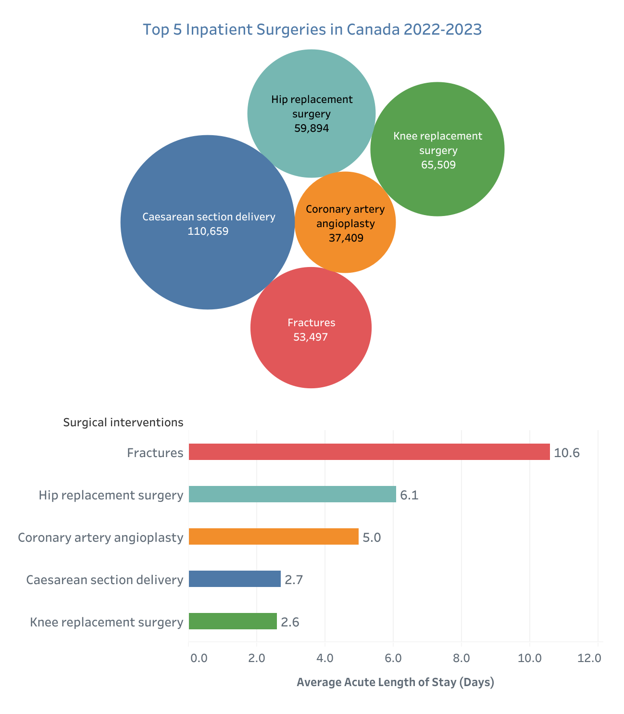
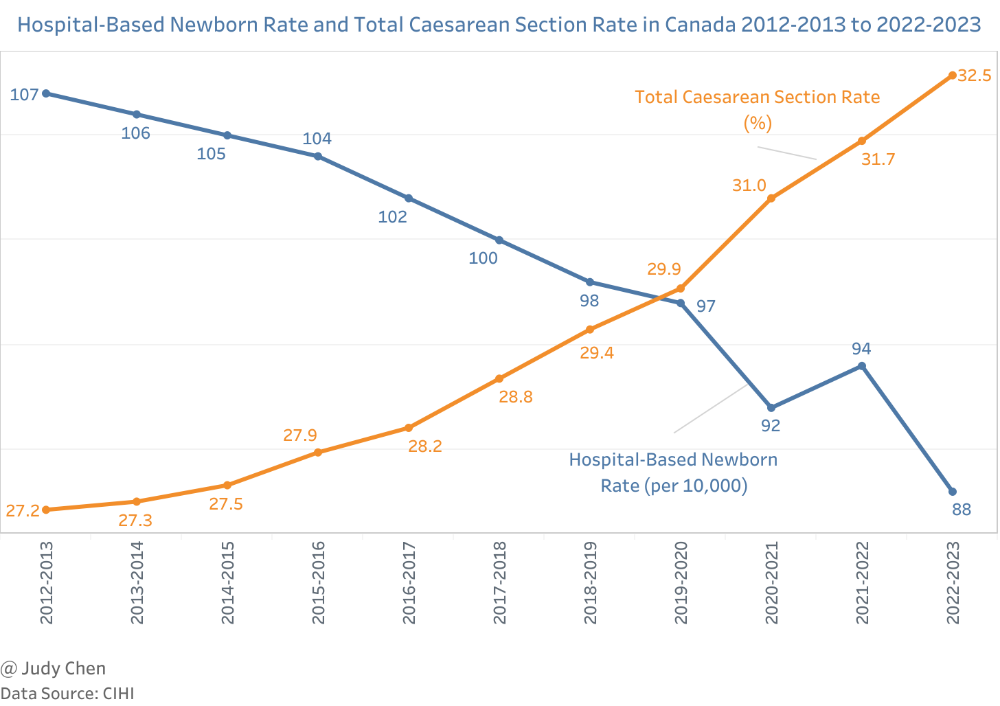
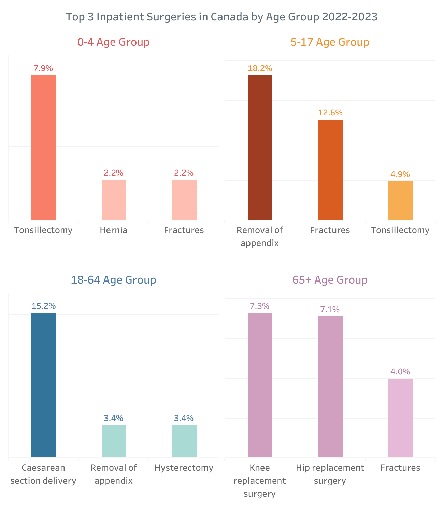
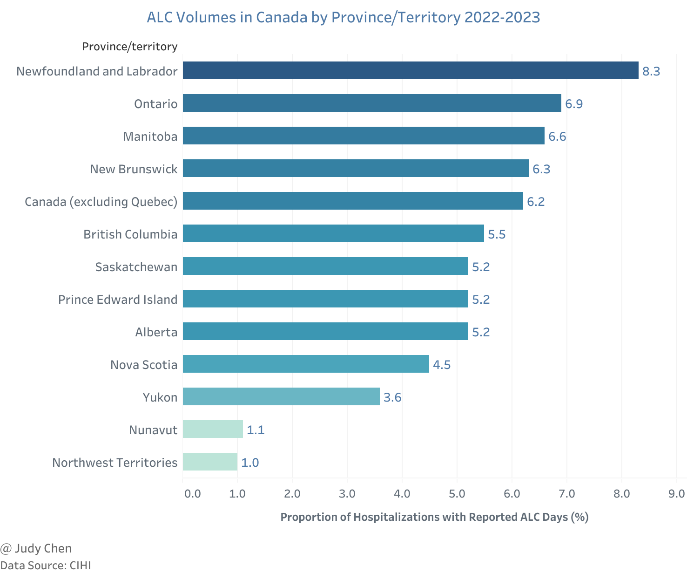

# Hospital Stays in Canada 2022-2023

What are the top reasons for hospital admissions in Canada? What are the most common surgeries across different age groups? This article uses data from the Canadian Institute for Health Information (CIHI) to explore hospital activity in Canada from April 1, 2022, to March 31, 2023.

## Volumes and LOS (Length of Stay) for Inpatient Hospitalizations

### Key Findings

* In 2022-2023, there were 2.96 million acute inpatient hospitalizations in Canada, up from 2.88 million in 2021-2022 and 2.72 million in 2020-2021, nearly returning to pre-pandemic levels.

* The average LOS in hospitals has been gradually increasing since 2017-2018, reaching 8.0 days in 2022-2023.

* After adjusting for age, sex, and population growth, the hospitalization rate in Canada was 7,000 per 100,000 population in 2022-2023, slightly higher than the previous year's rate of 6,983 per 100,000 population.

* The age-standardized average LOS was 7.3 days in 2022-2023, marginally longer than the 7.2 days recorded the previous year.

* In 2022-2023, Nunavut had the highest age-sex-standardized hospitalization rate at 15,342 per 100,000 population, with the shortest age-standardized average LOS of 3.8 days.

* Ontario had the lowest age-sex-standardized hospitalization rate at 6,666 per 100,000 population, while Manitoba had the longest age-standardized average LOS of 9.9 days among all provinces and territories.

> The age–sex-standardized hospitalization rate was calculated using the 2011 Canadian population as the standard population.

## Reasons for Inpatient Hospitalizations

### Key Findings

* The most common reason for inpatient hospitalization in 2022–2023 was childbirth, with an average acute LOS of 2.1 days. This was followed by COPD (Chronic Obstructive Pulmonary Disease) and bronchitis (7.2 days) and heart failure (9.5 days).

* The reasons for hospitalizations varied significantly across different age groups:

  * For children under 5, 14.7% were hospitalized due to acute lower respiratory infections, followed by neonatal jaundice (8.0%) and pneumonia (7.3%).

  * For children aged 5 to 17, the top reason was mental health disorders (10.6%), followed by appendicitis (7.0%) and mood disorders (5.4%).

  * For adults aged 18 to 64, about one-quarter of hospitalizations were due to childbirth.

  * For seniors aged 65 and over, the leading causes were heart failure (4.3%), COPD and bronchitis (4.0%), and COVID-19 (3.4%).

## Inpatient Surgeries

### Key Findings

* The most common inpatient surgery in Canada in 2022–2023 was Caesarean section (C-section), with an average acute LOS of 2.7 days. This was followed by knee replacement (2.6 days) and hip replacement (6.1 days).

* The C-section rate has gradually increased over the years, reaching 32.5% in 2022-2023, up from 27.2% in 2012-2013. Conversely, the hospital-based newborn rate has decreased from 107 per 10,000 population in 2012-2013 to 88 per 10,000 population in 2022-2023, following a brief rebound in 2021-2022.

* In 2022-2023, the most common surgeries for different age groups were:

  * For children under 5, tonsillectomy (7.9%), hernia repair, and fracture treatment (both 2.2%).

  * For children aged 5 to 17, the removal of the appendix (18.2%), fracture treatment (12.6%), and tonsillectomy (4.9%).

  * For adults aged 18 to 64, C-section deliveries (15.2%), with appendectomy and hysterectomy both at 3.4%.

  * For seniors aged 65 and over, knee replacement (7.3%), hip replacement (7.1%), and fracture treatment (4.0%).

## ALC (Alternate Level of Care) Volumes

### Key Findings

* In 2022-2023, 6.2% of hospital stays in Canada (excluding Quebec) involved ALC days, up from 5.8% the previous year.

* Newfoundland and Labrador had the highest proportion of hospitalizations with reported ALC days at 8.3%, followed by Ontario at 6.9%. The Northwest Territories and Nunavut had the lowest proportions at 1.0% and 1.1%, respectively.

> ALC refers to patients occupying hospital beds who do not require the intensity of resources/services provided in that care setting (acute, chronic or complex continuing care, mental health or rehabilitation).

## Conclusion

The data from CIHI for 2022-2023 reveals a slight increase in hospitalizations and average length of stay compared to previous years, with significant variations across different age groups and regions. Childbirth remains the most common reason for hospital admissions, while C-sections are the most frequent inpatient surgeries. Additionally, the proportion of hospital stays involving ALC days has increased slightly, with notable differences among provinces and territories.

**
May 2024
**