# Vancouver Rental Market 2023

The Vancouver rental market can be dissected into two primary categories: the primary rental market and the secondary rental market. The former encompasses purpose-built housing intended for rental purposes, including both market (private) and non-market (owned or operated by government or non-profit organizations) segments. On the other hand, the secondary rental market consists of privately-owned properties currently rented out, such as detached homes, laneway houses, secondary suites, townhomes, and rental condominiums. Notably, secondary rental housing lacks the security of its primary counterpart, as owners can withdraw units from the rental market at any time.

This article analyzes rental market in Metro Vancouver based on data from Canada Mortgage Housing Corporation (CMHC), and it is noteworthy that CMHC's primary rental market data only includes purpose-built rental apartments and townhouses, and CMHC's secondary rental market data includes rental condominiums only.

## Primary Rental Market

In Metro Vancouver, purpose-built market rental units represent about one-third of all rental units in the region.

### Inventory

#### Key Observations

* Over the past decade, purpose-built market rental units in Metro Vancouver have exhibited steady growth.

* Between 2013 and 2023, 2-bedroom units experienced the highest increase (21.5%), followed by bachelor units (20.1%) and 1-bedroom units (10.4%). In contrast, 3+ bedroom units saw a modest growth of 7.6%.

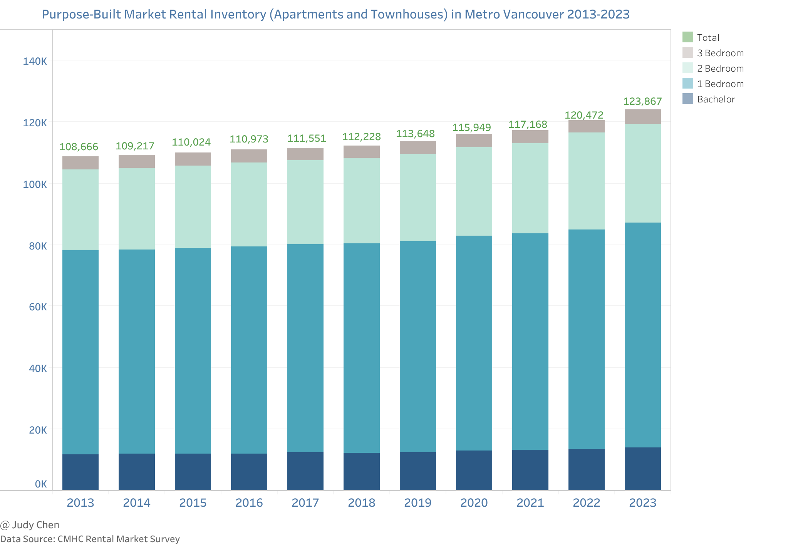

* Distribution and proportion of purpose-built rental units vary significantly across the region.

* Challenges persist in providing family-sized rental units, with only 30% of all purpose-built rental units offering 2+ bedrooms.

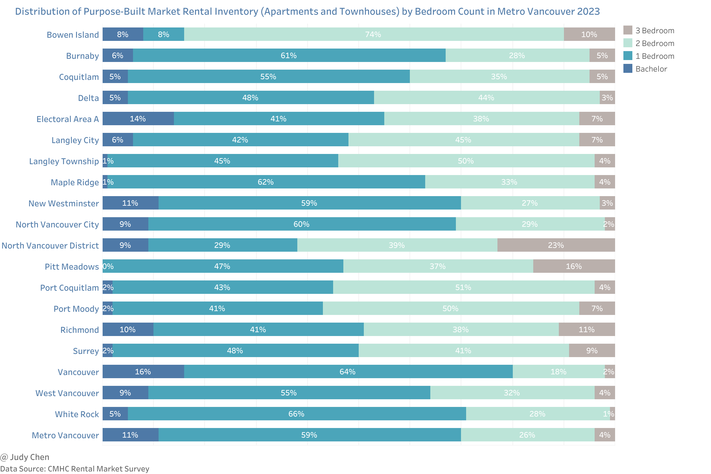

* In 2023, the City of Vancouver claimed the largest share (52%) of purpose-built rental units, while Surrey, despite its substantial population, held only a 6% share, ranking after Vancouver, Burnaby, and New Westminster.

* Vancouver (35%) and Burnaby (10%) led in the proportion of family-sized purpose-built market rentals in 2023.

* Between 2018 and 2023, Vancouver added the highest number of units (5,698), followed by Surrey (1,432) and New Westminster (1,203).

* Conversely, Burnaby and Richmond lost the greatest number of units (-744 and -259,respectively) during this time.

* Bowen Island and Langley Township increased their rental stock by 225% and 129%, respectively, while Electoral Area A faced the greatest decline (-13%).

### Median Rents

Analyzing median rents offers insights into affordability, particularly when compared to changes in inflation and incomes.

#### Key Observations

* In 2023, the median rent for a purpose-built rental unit in Metro Vancouver increased by 8.9% to `$1,715` since 2022.

* Over the past decade, the median market rent for purpose-built market rental inventory in Metro Vancouver increased by 72%, in compasion with 75% in BC and 50% in Canada.

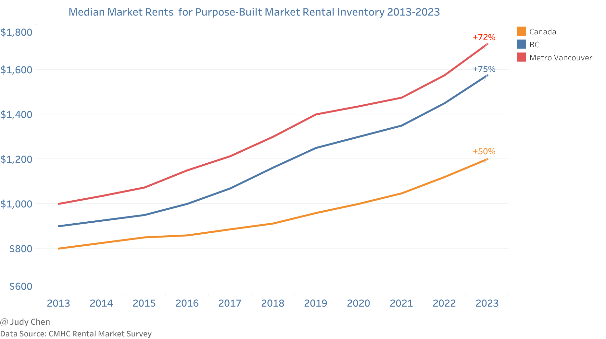

* Median rents outpaced inflation and average wage growth, increasing by 72% between 2013 and 2023, compared to a 39% increase in BC wages and a 29% rise in inflation.

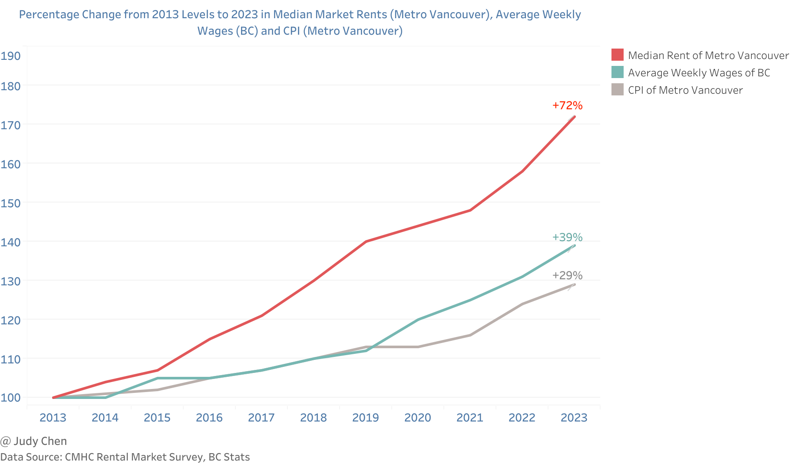

* Electoral Area A (`$2,550`), West Vancouver (`$2,300`) and North Vancouver District (`$2,228`) reported the highest median rents in 2023.

* Median rents rose across all regions in 2023 except for Pitt Meadows (+0%), with Coquitlam experiencing the highest increase (+25%), followed by Langley City (+17.6%) and Richmond (+15.9%).

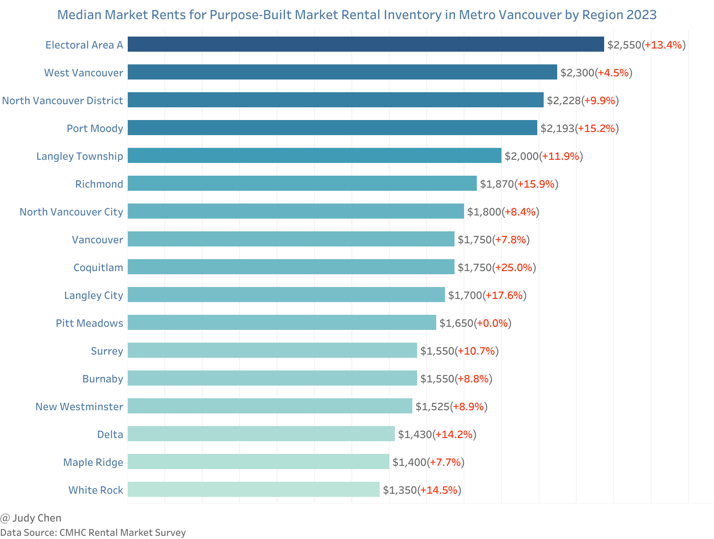

### Average Rents of Vacant and Occupied Units

Understanding the difference in rent between vacant and occupied units sheds light on the challenges faced by those seeking rental homes. The asking rents for vacant units are higher than the rents of occupied units as annual rent increases in occupied units are limited by a maximum allowable rate set out by the BC Government each year.

#### Key Observations

* In 2023, the average asking rent for a vacant unit in Metro Vancouver was `$2,159`, 18.3% higher than the average rent for an occupied unit. This gap decreased by over 20% since 2022.

* Larger units, particularly those with 3 bedrooms or more (26.9%; `$665`), and 2 bedrooms (19.9%; `$434`), exhibited the most significant difference in rent between vacant and occupied units.

* The notable difference underscores the challenges faced by larger households, primarily families, during relocations.

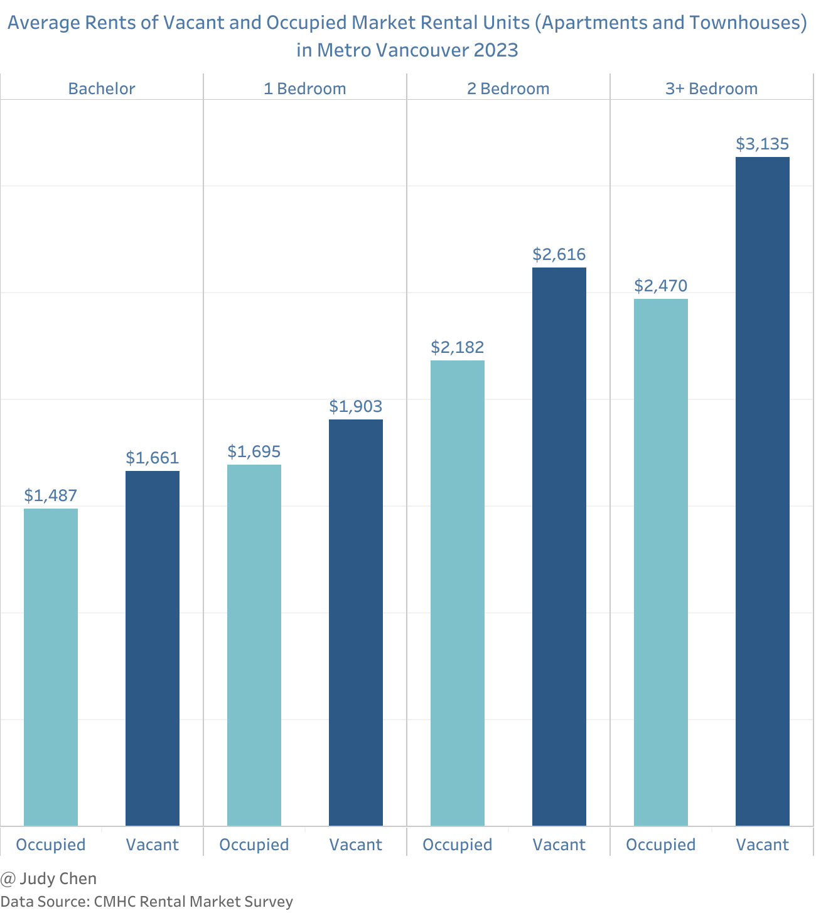

* In 2023, West Vancouver and North Vancouver District reported the highest average asking rents for vacant units in Metro Vancouver (same as in 2021 and 2022), while Maple Ridge/Pitt Meadows reported the lowest average asking rents for vacant units.

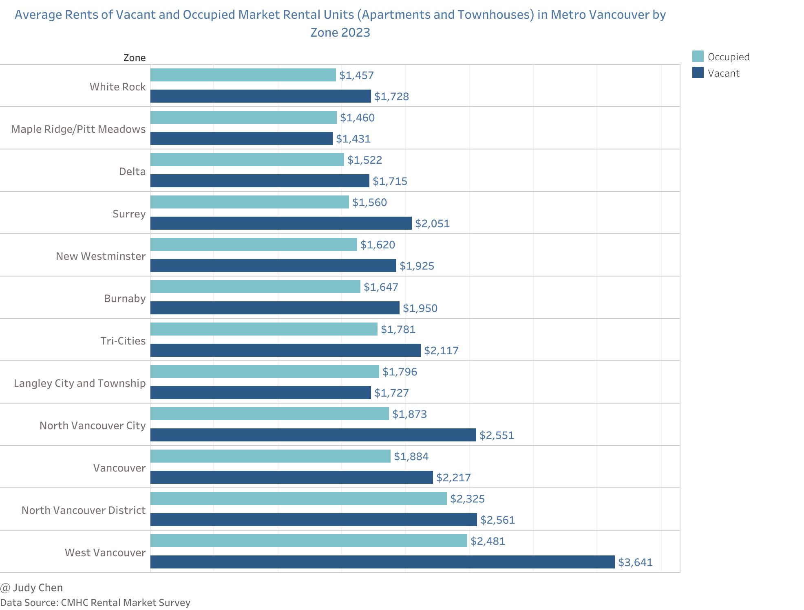

* In 2023, West Vancouver displayed the largest difference (46.8%) in average rent between vacant and occupied units, followed by North Vancouver City (36.2%) and Surrey (31.5%).

* Conversely, Langley City and Township, Maple Ridge/Pitt Meadowns, and Delta showed the smallest difference in rents between vacant and occupied units.

### Vacancy Rates

Vacancy rates serve as a key indicator of the rental market's health, with rates around 3% to 5% considered balanced.

#### Key Observations

* Metro Vancouver's vacancy rates varied from 2000 to 2023 but consistently remained below the healthy 3% threshold.

* The COVID-19 pandemic led to a spike in the regional vacancy rate in 2020, reaching 2.6%, the highest in the last 20 years.

* Historically, low vacancy rates correlated with increased rent costs. In 2022, a slight vacancy rate decrease coincided with a steep increase in average annual rent. With the vacancy rate at 0.9% in 2023, average annual rent surged by 9.5%, the highest level since 2000.

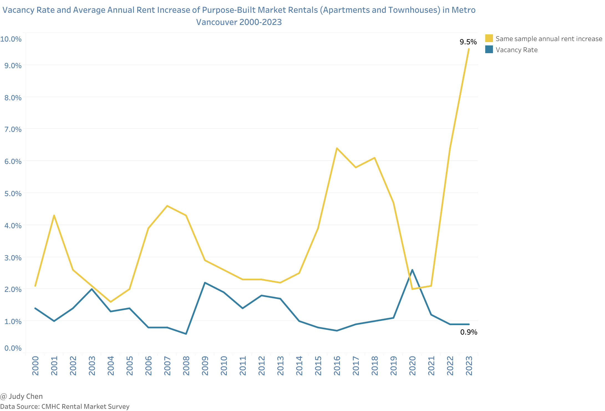

* Although vacancy rates vary by bedroom count, the vacancy rates for each type of unit tend to follow the same trend as the overall
vacancy rate.

* Historically, vacancy rates for 3+ bedroom units tended to be higher than all others in most time.

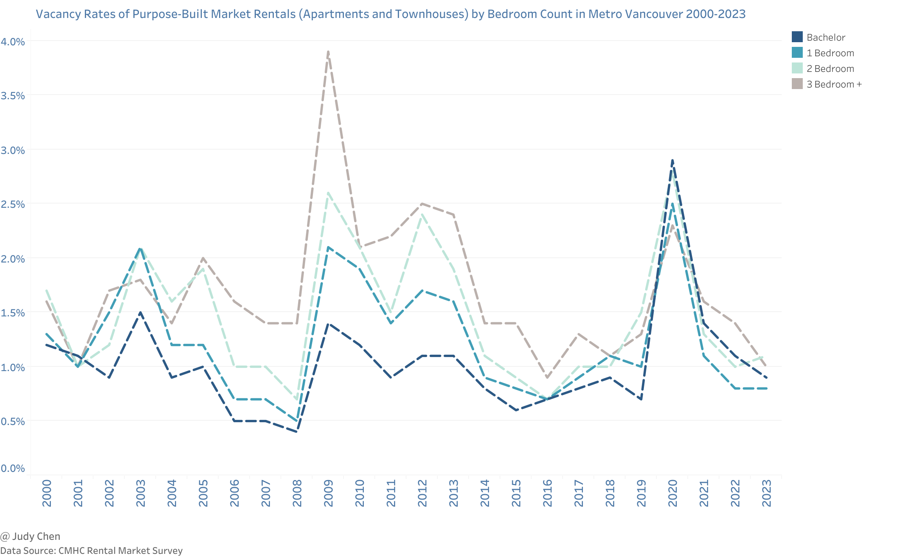

* Vacancy rates varied widely across the region, with North Vancouver District reporting the highest vacancy rate in 2023 (1.9% higher than the regional average), while Richmond and Port Coquitlam had the lowest rates (0.2%), followed by Electoral Area A and Coquitlam (0.3%).

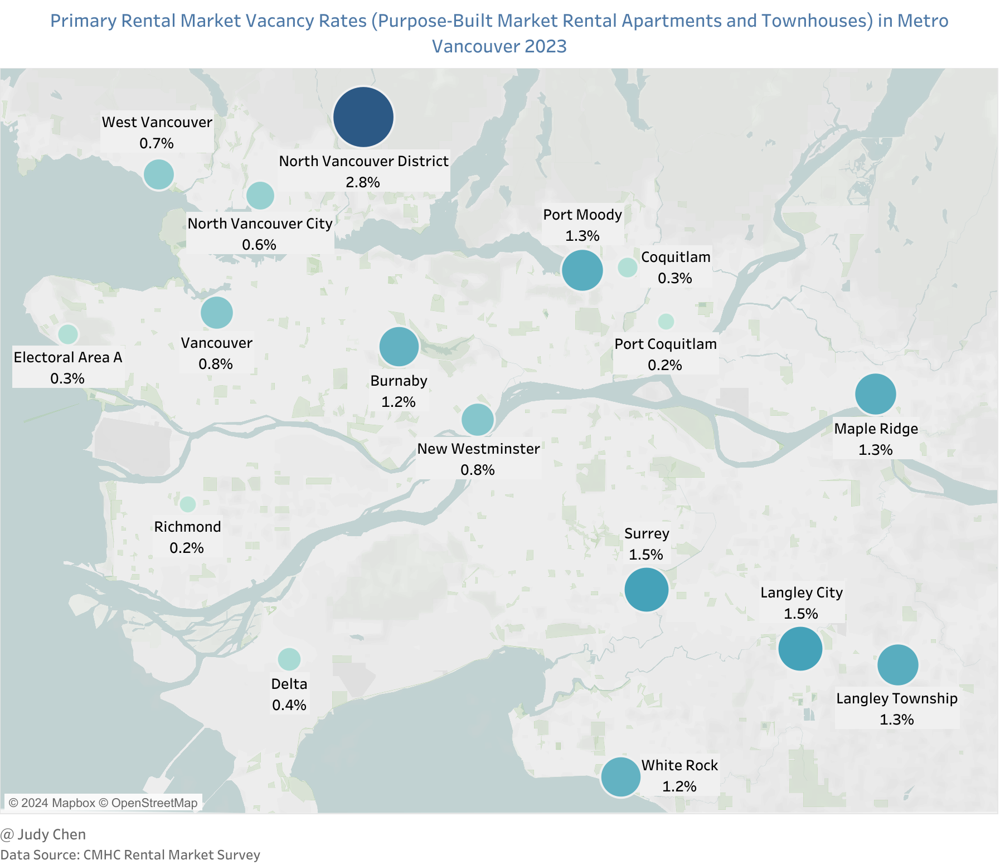

## Secondary Rental Market

The secondary rental market encompasses rented condominiums and privately rented single detached homes, secondary suites, laneway houses, etc. Data on the secondary rental market is derived from CMHC and includes rental condominiums exclusively.

### Inventory

#### Key Observations

* In 2023, Metro Vancouver had 93,961 rental condominiums, compared to 121,692 purpose-built rental apartments.

* Between 2013 and 2023, rental condominiums witnessed an 83.4% increase (42,737 units), outpacing the 15.3% growth (16,145 units) in purpose-built rental apartments during the same period.

* On average, 31.8% of all condos in Metro Vancouver were rentals in 2023, varying accross the region.

* While the number of rental condominiums expanded by 6,329 units in 2023, this represented a slowdown from the 7,850 units added in 2022, mainly attributed to fewer newly added condominiums rented in the same year.

### Average Rents

Rental condominiums, generally larger and newer than purpose-built rental apartments, command higher rents on average.

#### Key Observations

* In 2023, the average rent for a rental condominium in Metro Vancouver was `$2,356`, 29.5% (or `$537`) higher than the average rent for a purpose-built rental apartment (`$1,819`).

* Available data indicates a 15.3% increase in the average rent of 1-bedroom rental condominiums from 2021 to 2023, while 2-bedroom rental condominiums experienced a more modest 3.3% increase during the same period.

### Vacancy Rates

Despite higher average rents, rental condominiums maintain lower vacancy rates than purpose-built rental apartments and townhouses, signaling greater demand.

#### Key Observations

* Over the past decade, rental condominiums consistently exhibited lower vacancy rates than purpose-built rental apartments and townhouses in most time.

* In 2023, the vacancy rate for rental condominiums in Metro Vancouver was 0.9%, a 1.3% decrease from the previous year, and equal to the vacancy rate for purpose-built apartments and townhouses in 2023.

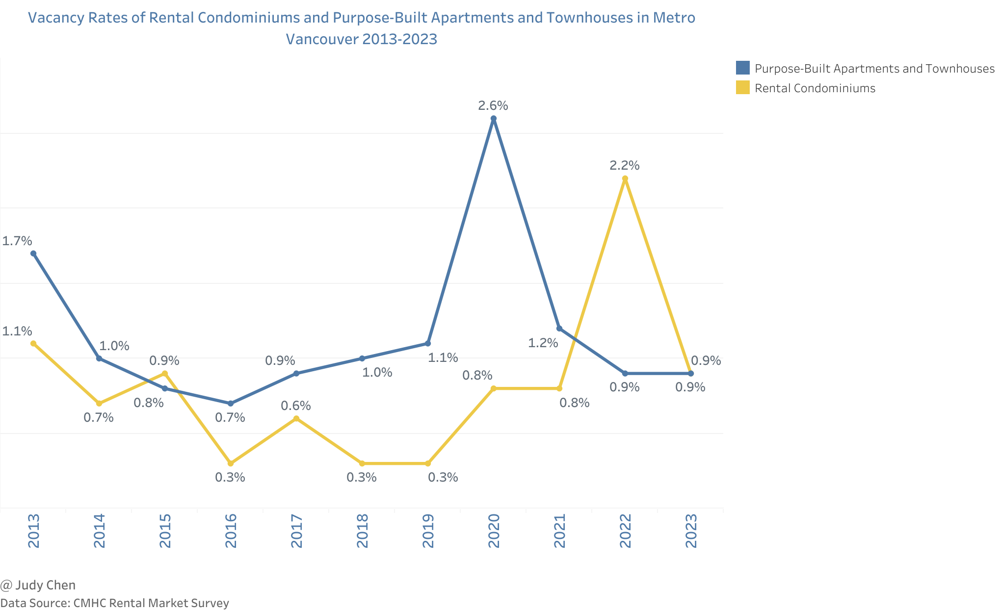

## Conclusion

The rental market in Metro Vancouver remained tight in 2023, with average vacancy rates for both purpose-built rental apartments and townhouses and rental condominiums holding steady at 0.9%. The surge in immigration to British Columbia added further strain, as newcomers, often renters, sought housing. Simultaneously, escalating mortgage costs and higher income requirements likely delayed home purchases, keeping potential buyers in the rental market.

Affordability waned, with rent growth outpacing average wage growth by a considerable margin. Lower-income renters faced heightened pressure and often opted for more affordable but smaller units or shared living arrangements that fit their budget but may not meet their housing needs.

Addressing the growing demand and ensuring affordability requires concerted efforts to enhance the rental supply. Action is imperative to create a balanced and accessible rental market in Metro Vancouver.

**
March 2024
**