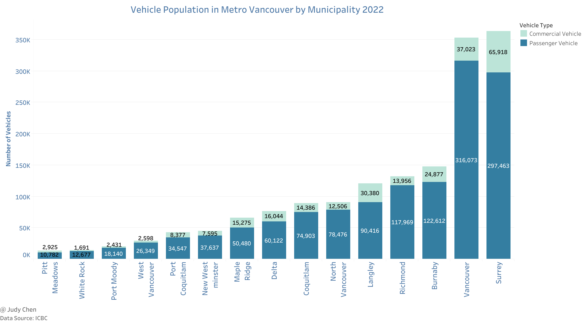
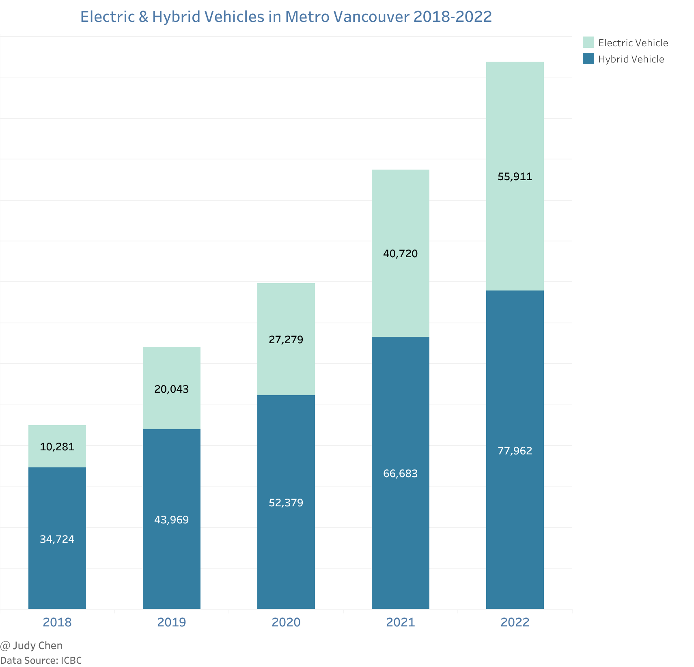
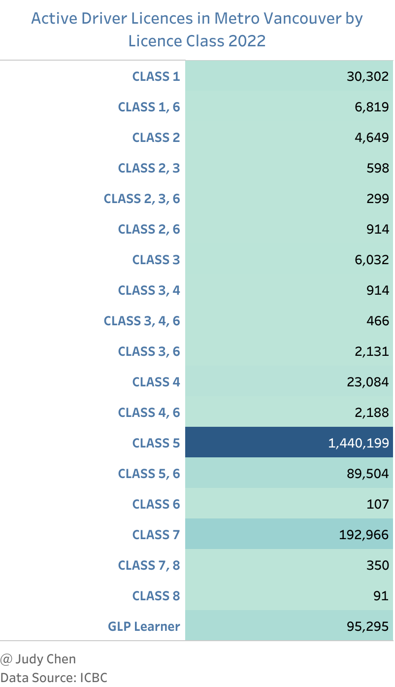
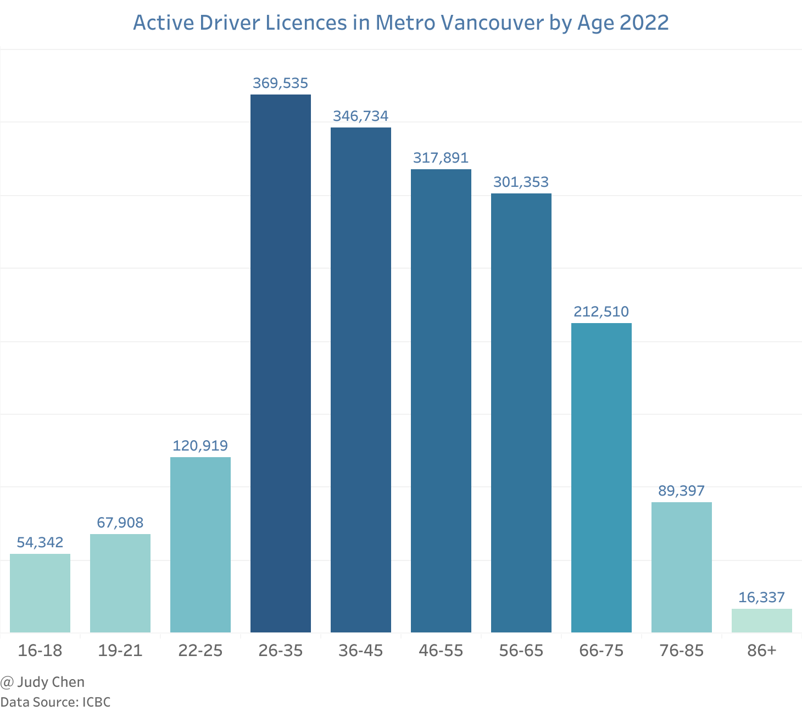
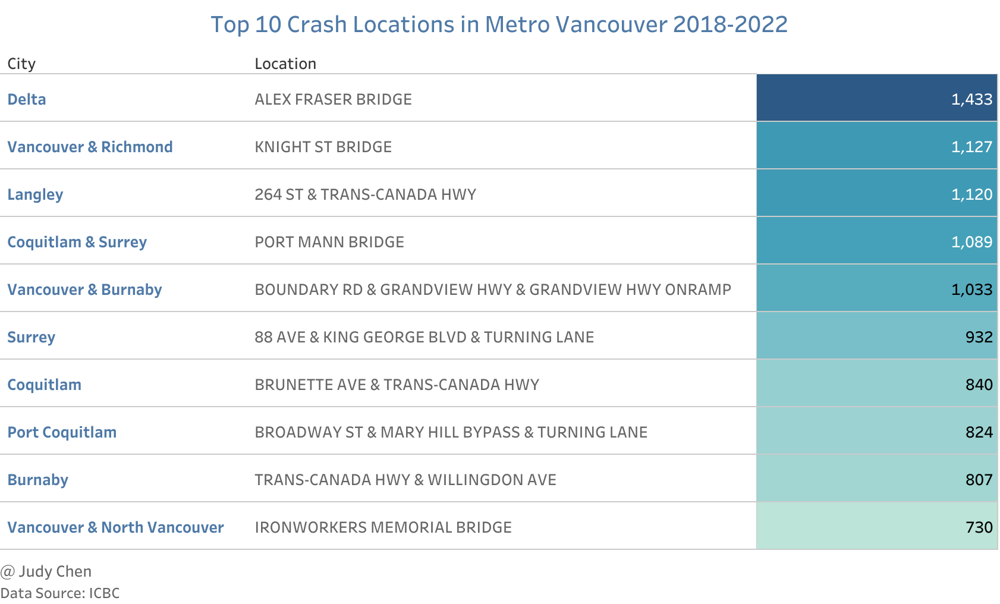
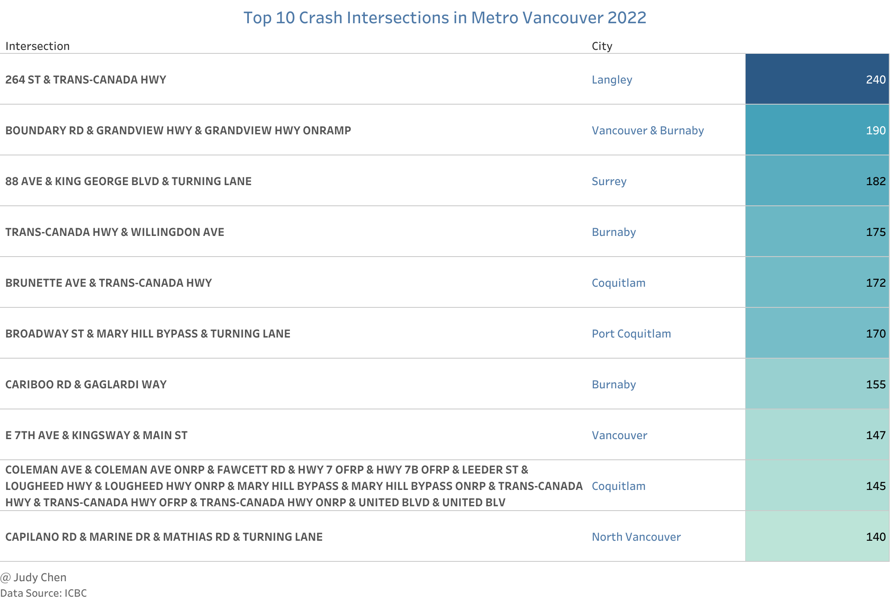
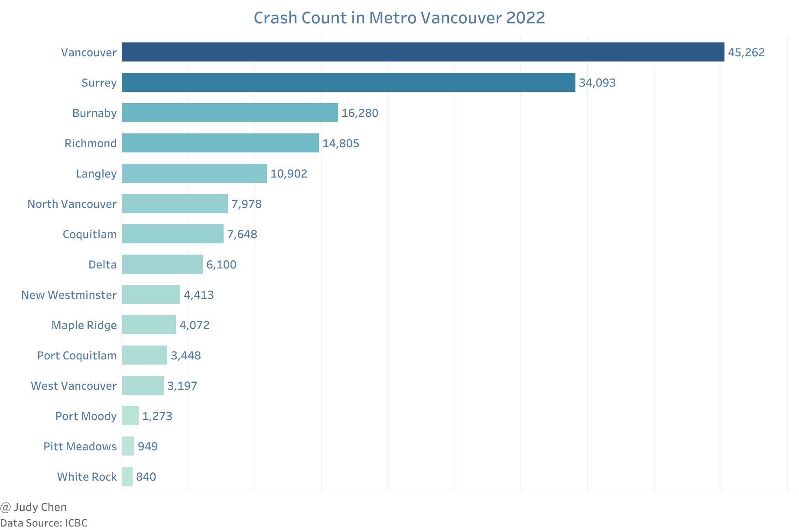
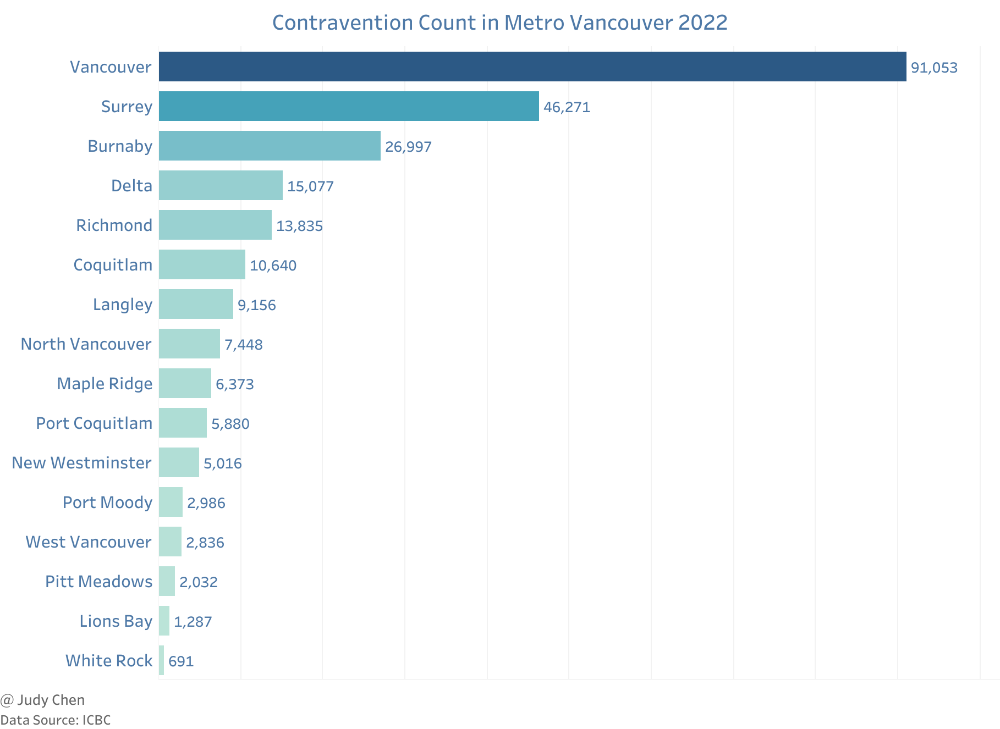
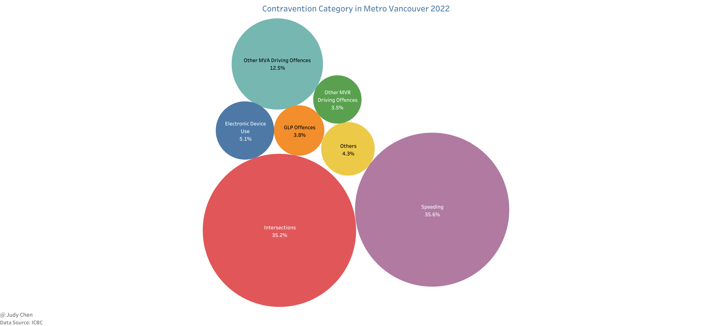
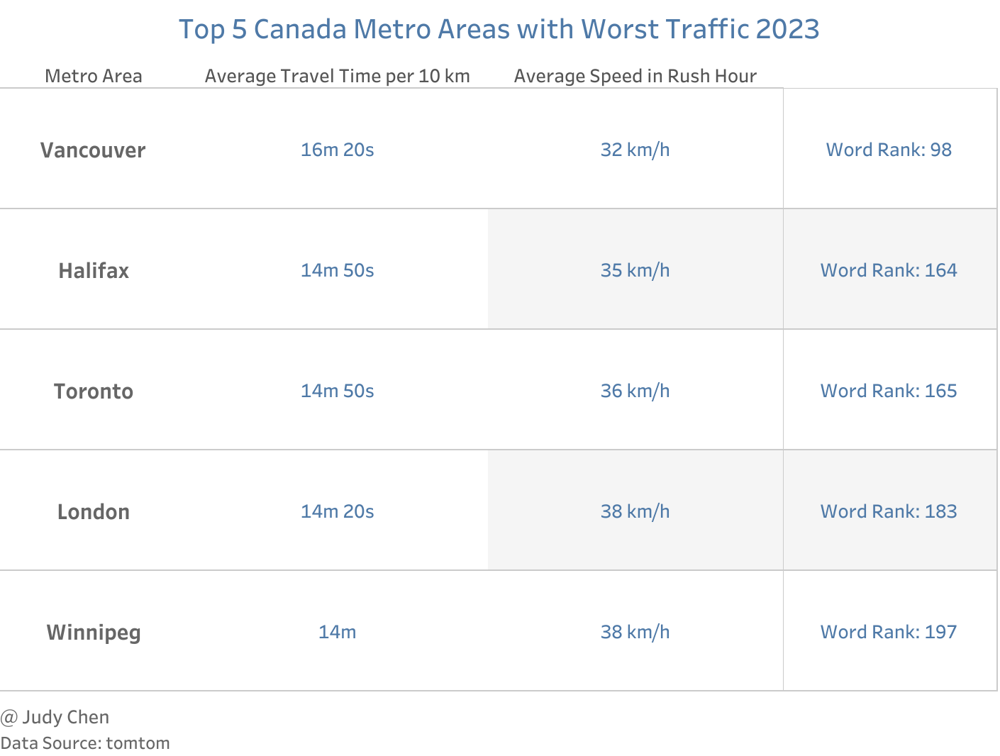

# Vehicle & Traffic in Vancouver

This article presents a comprehensive exploration of the current and historical data surrounding vehicle and traffic patterns in Metro Vancouver. Utilizing information from Insurance Corporation of British Columbia (ICBC) and TomTom, we aim to shed light on key observations, trends, and challenges that define the region's vehicular landscape.

## Vehicle Population

### Key Observations

* Surrey led the region in total vehicle population in 2022, encompassing both commercial and passenger vehicles. Notably, it also claimed the highest number of commercial vehicles.

* Vancouver, on the other hand, boasted the highest passenger vehicle population in the same year.

* West Vancouver distinguished itself with an impressive 91% of its total vehicle population attributed to passenger vehicles, while Langley dominated in commercial vehicles, constituting 25% of its total vehicle count.

* The period from 2018 to 2022 witnessed substantial growth in both electric and hybrid vehicles, with electric vehicle numbers soaring by an impressive 444%.

## Driver Licenses

### Active Driver Licenses

#### Key Observations

* In 2022, drivers holding active class-5 licenses comprised approximately 76% of the total active licensed drivers in Metro Vancouver.

* The age group between 26-35 years peaked in active licensed drivers, with a gradual decline observed with increasing age.

* Drivers under the age of 19 accounted for 54,342 individuals in 2022, making up nearly 3% of the total active licensed drivers in Metro Vancouver.

### Driver Knowledge Test

#### Key Observations

* Pass rates for knowledge tests (class 5 & 7) at the eight main ICBC office locations peaked in 2020 between 2018 and 2022.

* Vancouver (Point Grey) consistently held the highest pass rate, exceeding 74%, while Surrey (13426 78 Ave) consistently recorded the lowest pass rate, below 56%.

_2018-2022.png)

### Driver Road Test

#### Key Observations

* Pass rates for road tests (class 5 & 7) varied across the eight ICBC office locations. Burnaby (3880 Lougheed Highway) and Vancouver (Point Grey) maintained relatively high pass rates above 50% from 2018 to 2022.

* Richmond (Lansdowne) exhibited a consistent increase in pass rates from 2018 to 2022, surpassing Surrey (13426 78 Ave) from 2019.

_2018-2022.png)

## Crash

### Key Observations

* Locations such as bridges, highways, and turning lanes proved prone to crashes, with the Alex Fraser Bridge in Delta experiencing the highest number of crashes from 2018 to 2022.

* In 2022, the intersection between 264 Street and Trans-Canada Hwy in Langley reported the highest number of crashes.

* Vancouver and Surrey accounted for nearly half of total crashes in 2022 (28% and 21% respectively), followed by Burnaby (10%).

## Contravention

### Key Observations

* Over one-third of total contraventions in 2022 occurred in Vancouver, with Surrey and Burnaby following closely.

* Speeding and intersection-related contraventions constituted over 70% of total contraventions in Metro Vancouver in 2022, with electronic device use contributing to 5.1%.

## Traffic Index

### Key Observations

* According to TomTom's traffic index, Metro Vancouver exhibited the worst traffic among all metro areas in Canada in 2023, ranking 98 worldwide.

* The average travel time for 10 km increased by 20 seconds from 2022 to 2023, totaling 16 minutes and 20 seconds.

## Conclusion

The intricate analysis of vehicle and traffic data in Metro Vancouver reveals a complex landscape marked by diverse trends and challenges. Understanding these patterns is crucial for devising effective strategies to enhance traffic management and commuter experiences in the region.

**
February 2024
**
