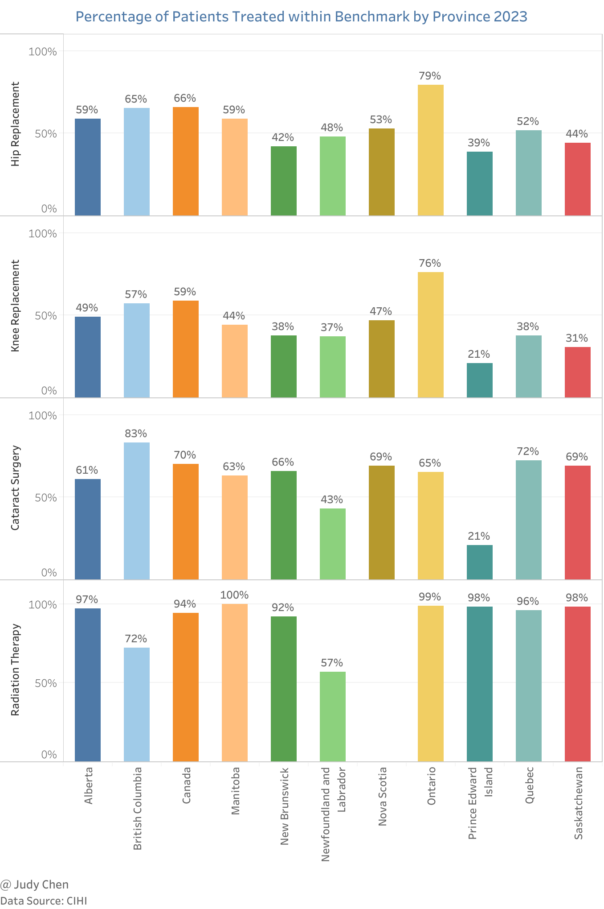
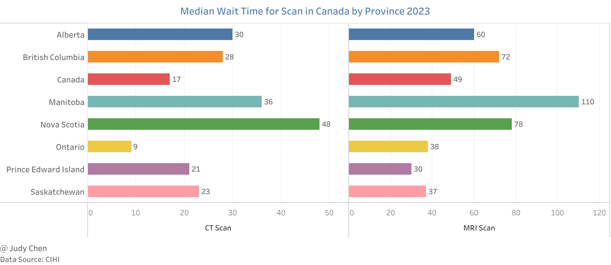
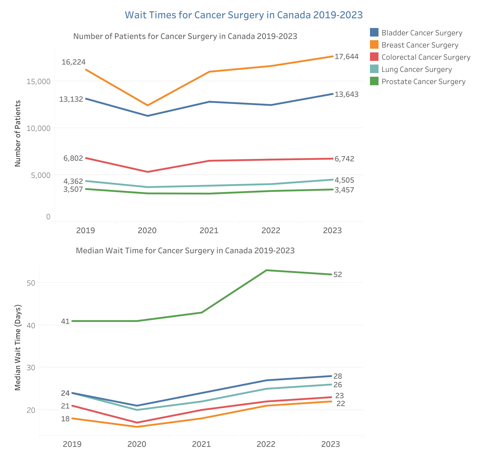
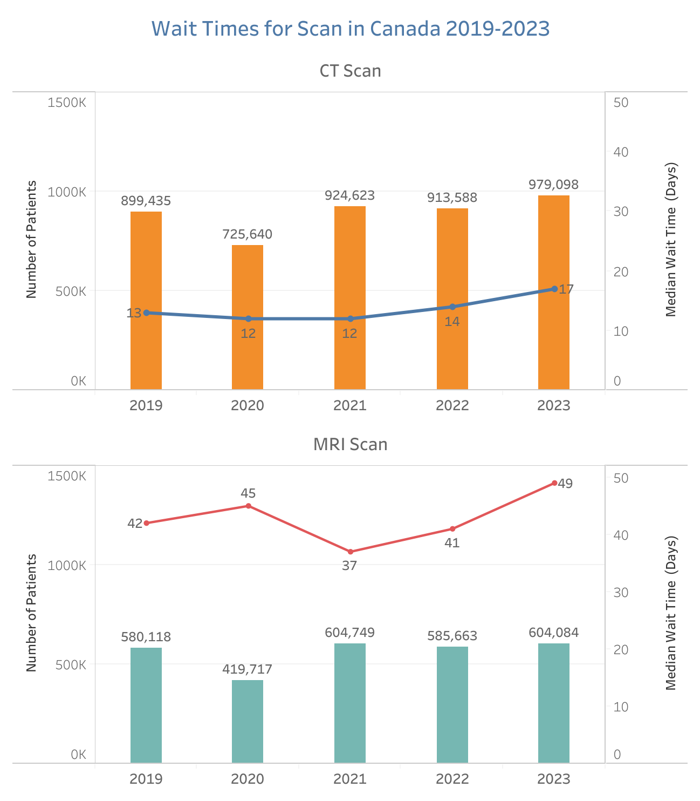
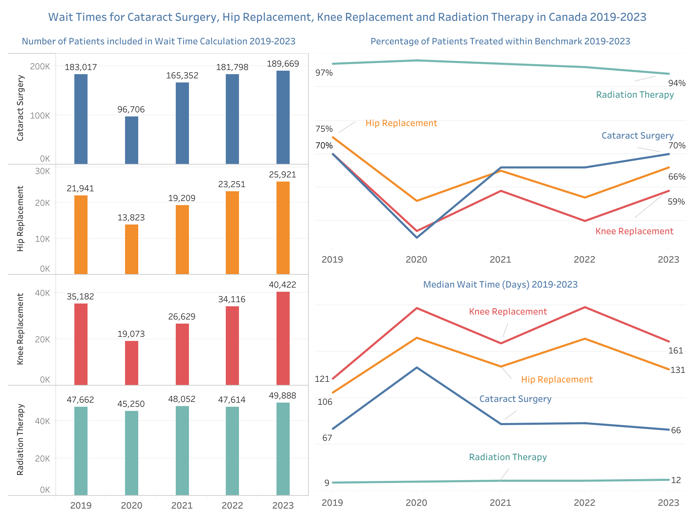

# Wait Times for Priority Procedures

Are Canadians waiting longer for priority procedures such as hip and knee replacements, cataract and cancer surgeries, and diagnostic imaging compared to the pre-pandemic period? Have the volumes of these priority procedures recovered to pre-pandemic levels in Canada? Let's explore data from CIHI to understand recent trends in surgical volumes and wait times.

> The data in this article covers the period from April 1 to September 30 for the years 2019 to 2023.

## Wait Times in Canada 2023

### Percentage Meeting Benchmark

#### Key Findings

* Between April and September 2023, 94% of patients in Canada received radiation therapy within the benchmark time, followed by 70% for cataract surgery and 66% for hip replacement.

* For hip and knee replacements, Ontario had the highest percentage of patients treated within the benchmark in 2023, with 79% for hip replacements and 76% for knee replacements. British Columbia followed with 65% and 57%, respectively. Prince Edward Island had the lowest percentages, with 39% for hip replacements and 21% for knee replacements within the recommended 182 days.

* In British Columbia, 83% of patients received cataract surgery within the benchmark time between April and September 2023, followed by Quebec at 72%. Prince Edward Island had the lowest percentage, with only 21% of patients treated within the benchmark.

* All patients in Manitoba received radiation therapy within the recommended 4 weeks between April and September 2023, followed by Ontario at 99%. Newfoundland and Labrador had the lowest rate, with only 57% of patients receiving radiation therapy within the benchmark.

> The benchmark for hip/knee replacement is 182 days, for cataract surgery is 112 days, and for radiation therapy is 28 days.

### Median Wait Time for Diagnostic Imaging

#### Key Findings

* In 2023, patients in Canada had a median wait time of 49 days for an MRI scan, compared to 17 days for a CT scan.

* Patients in Ontario had the shortest median wait time for a CT scan at 9 days, followed by Prince Edward Island at 21 days and Saskatchewan at 23 days. Nova Scotia had the longest median wait time for a CT scan at 48 days.

* For MRI scans in 2023, Manitoba had the longest median wait time at 110 days. In contrast, patients in Prince Edward Island waited a median of 30 days, followed by Saskatchewan at 37 days and Ontario at 38 days.

## Wait Times in Canada 2019-2023

### Wait Time for Cancer Surgery 2019-2023

#### Key Findings

* More patients received bladder, breast, and lung cancer surgeries in 2023 compared to 2019, while slightly fewer patients received colorectal and prostate cancer surgeries in 2023 than in 2019.

* Median wait times for bladder, breast, colorectal, and lung cancer surgeries were 2 to 4 days longer in 2023 than in 2019, with prostate cancer surgery wait times increasing by 11 days.

* The number of patients receiving breast cancer surgery increased the most (8.75%) from 2019 to 2023, with the median wait time increasing from 18 days in 2019 to 22 days in 2023.

### Wait Time for Diagnostic Imaging 2019-2023

#### Key Findings

* Between April and September 2023, median wait times were 4 days longer for CT scans and 7 days longer for MRI scans compared to the same period in 2019.

* Following a significant drop in 2020, the number of patients undergoing CT and MRI scans exceeded pre-pandemic levels from 2021 onwards, increasing by 8.9% and 4.1%, respectively, from 2019 to 2023.

### Wait Time for Other Priority Procedures 2019-2023

#### Key Findings

* The median wait time for cataract surgery returned to pre-pandemic levels, with 70% of patients treated within the recommended 112 days in both 2019 and 2023 (the percentage had dropped to 45% in 2020).

* Between 2019 and 2023, the percentage of patients receiving radiation therapy within the benchmark slightly decreased from 97% to 94%, with the median wait time increasing from 9 days to 12 days.

* Between April and September 2023, a smaller percentage of patients received hip or knee replacements within the recommended 6 months compared to the same period in 2019, despite an increase in the number of surgeries performed (18% and 15%, respectively).

## Conclusion

The analysis of recent trends in wait times and volumes for priority procedures in Canada reveals a mixed recovery post-pandemic. While some procedures, such as cataract surgeries, have returned to pre-pandemic wait times, others, including hip and knee replacements, still face challenges. Radiation therapy remains largely accessible within benchmarks, though regional disparities persist. Diagnostic imaging wait times have generally increased, indicating areas needing improvement to meet patient needs efficiently. Overall, while strides have been made in returning to pre-pandemic levels, ongoing efforts are essential to address wait time issues and ensure timely access to critical medical procedures.

**
June 2024
**